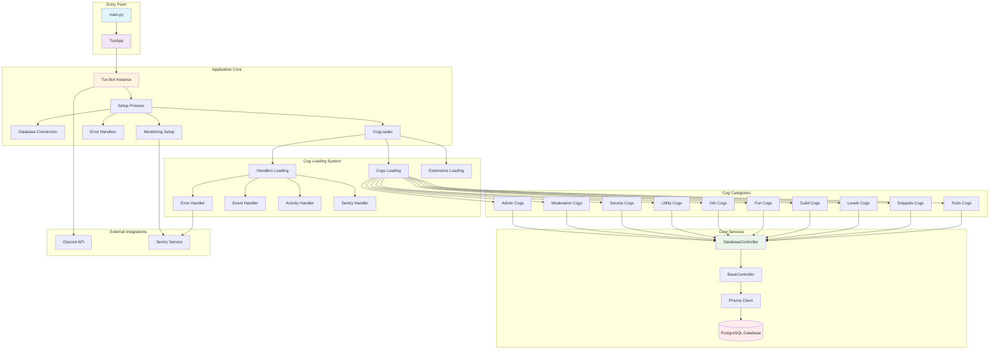
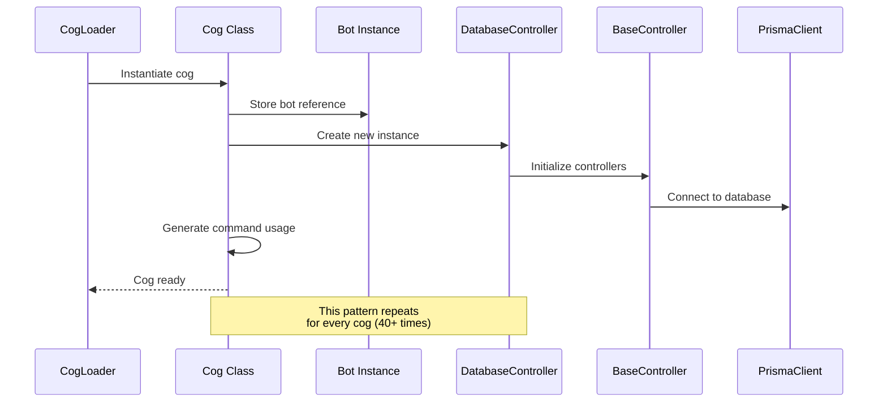
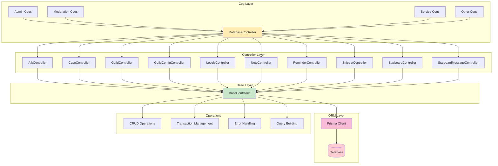
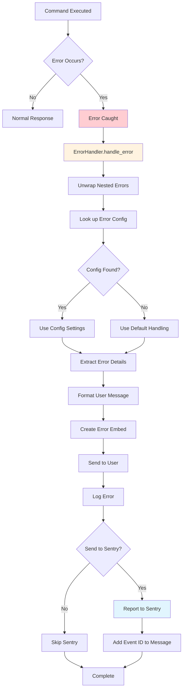
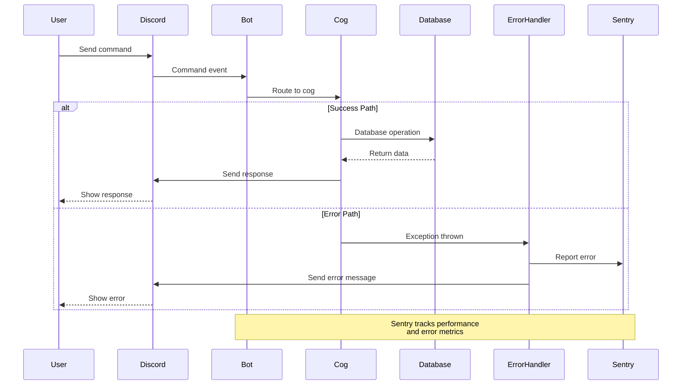
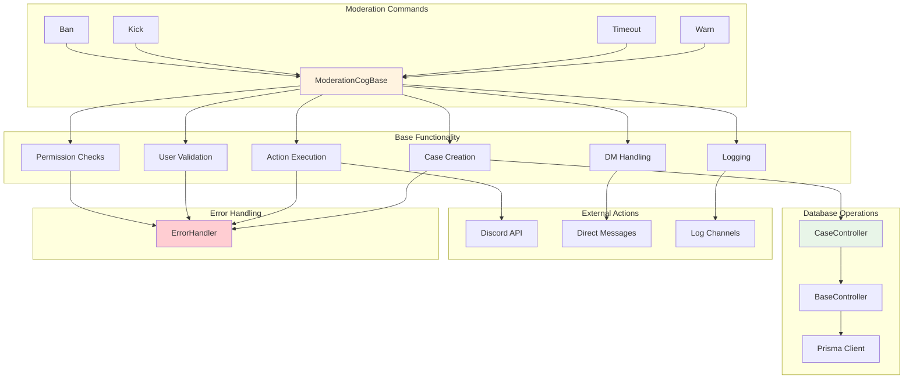
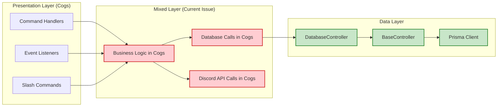
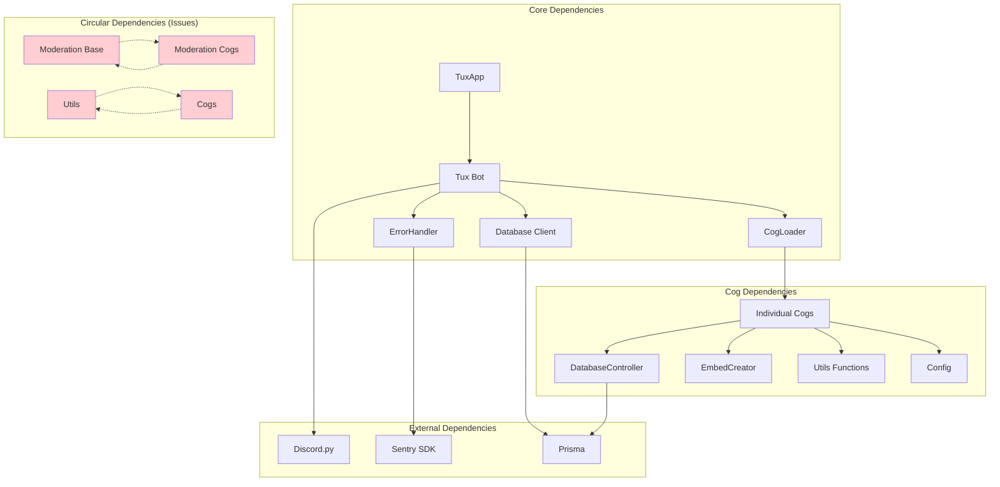
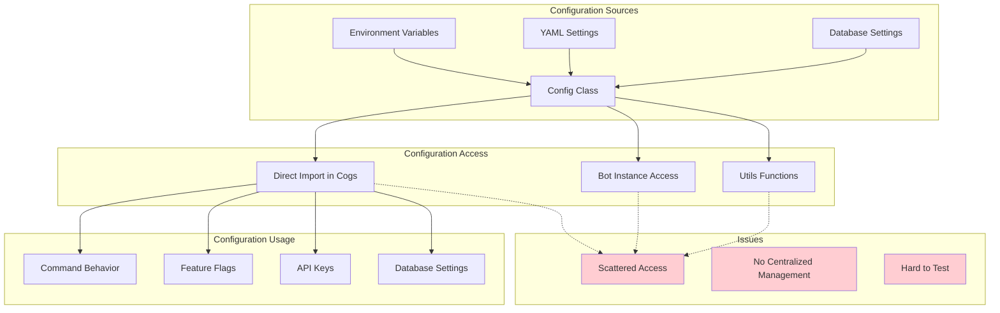
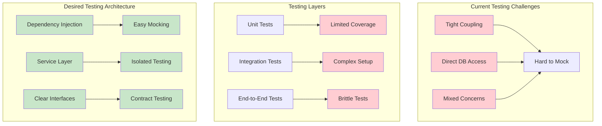

# System Architecture Diagrams

## 1. Overall System Architecture

## 2. Cog Initialization Pattern

## 3. Database Access Architecture

## 4. Error Handling Flow

## 5. Command Execution Lifecycle

## 6. Moderation System Architecture

## 7. Service Layer Architecture (Current State)

## 8. Dependency Relationships

## 9. Configuration Management

## 10. Testing Architecture (Current Limitations)

These diagrams illustrate the current architecture and highlight both the strengths and areas for improvement in the Tux Discord bot system. The visual representation makes it clear where architectural debt exists and provides a foundation for the improvement recommendations.
