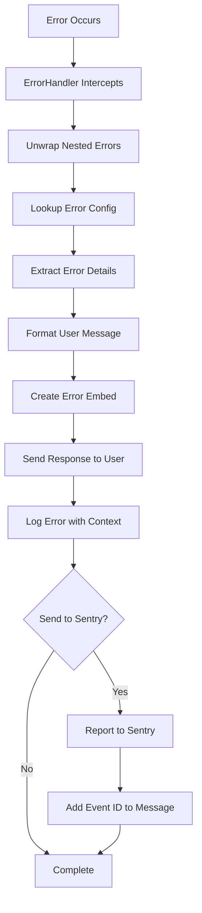

# Error Handling Analysis

## Overview

This document provides a comprehensive analysis of error handling approaches across the Tux Discord bot codebase, examining the centralized error handling system, inconsistencies in implementation, and areas for improvement.

## 1. Centralized Error Handling Architecture

### 1.1 ErrorHandler Cog Structure

The bot implements a sophisticated centralized error handling system through the `ErrorHandler` cog:

```python
class ErrorHandler(commands.Cog):
    def __init__(self, bot: Tux) -> None:
        self.bot = bot
        self._old_tree_error = None
    
    async def cog_load(self) -> None:
        # Override application command error handler
        tree = self.bot.tree
        self._old_tree_error = tree.on_error
        tree.on_error = self.on_app_command_error
    
    @commands.Cog.listener()
    async def on_command_error(self, ctx, error):
 # Handle prefix command errors
        
    async def on_app_command_error(self, interaction, error):
        # Handle slash command errors
```

### 1.2 Error Configuration System

**ErrorHandlerConfig Structure:**

```python
@dataclass
class ErrorHandlerConfig:
    message_format: str                    # User-facing message template
    detail_extractor: ErrorDetailExtractor # Function to extract error details
    log_level: str = "INFO"               # Logging severity level
    send_to_sentry: bool = True           # Whether to report to Sentry
```

**Configuration-Driven Approach:**

- `ERROR_CONFIG_MAP` defines handling for 50+ error types
- Consistent user messaging across all error scenarios
- Centralized control over logging levels and Sentry reporting

### 1.3 Error Processing Flow



## 2. Error Categories and Handling

### 2.1 Discord.py Command Errors

**Permission-Related Errors:**

```python
commands.MissingPermissions: ErrorHandlerConfig(
    message_format="You lack the required permission(s): {permissions}",
    detail_extractor=_extract_permissions_details,
    send_to_sentry=False,
),
commands.BotMissingPermissions: ErrorHandlerConfig(
    message_format="I lack the required permission(s): {permissions}",
    detail_extractor=_extract_permissions_details,
    log_level="WARNING",
    send_to_sentry=True,
),
```

**Argument-Related Errors:**

```python
commands.MissingRequiredArgument: ErrorHandlerConfig(
    message_format="Missing required argument: `{param_name}`\nUsage: `{ctx.prefix}{usage}`",
    detail_extractor=_extract_missing_argument_details,
    send_to_sentry=False,
),
commands.BadArgument: ErrorHandlerConfig(
    message_format="Invalid argument provided: {error}",
    send_to_sentry=False,
),
```

**Entity Not Found Errors:**

```python
commands.MemberNotFound: ErrorHandlerConfig(
    message_format="Could not find member: {error.argument}.",
    send_to_sentry=False,
),
commands.UserNotFound: ErrorHandlerConfig(
    message_format="Could not find user: {error.argument}.",
    send_to_sentry=False,
),
```

### 2.2 Application Command Errors

**Slash Command Specific:**

```python
app_commands.CommandSignatureMismatch: ErrorHandlerConfig(
    message_format="Internal error: Command signature mismatch. Please report this.",
    log_level="ERROR",
    send_to_sentry=True,
),
app_commands.TransformerError: ErrorHandlerConfig(
    message_format="Failed to process an argument value: {error}",
    log_level="INFO",
    send_to_sentry=False,
),
```

### 2.3 Custom Application Errors

**Permission Level Errors:**

```python
PermissionLevelError: ErrorHandlerConfig(
    message_format="You need permission level `{error.permission}` to use this command.",
    send_to_sentry=False,
),
AppCommandPermissionLevelError: ErrorHandlerConfig(
    message_format="You need permission level `{error.permission}` to use this command.",
    send_to_sentry=False,
),
```

**Code Execution Errors:**

```python
MissingCodeError: ErrorHandlerConfig(
    message_format="{error}",
    log_level="INFO",
    send_to_sentry=False,
),
CompilationError: ErrorHandlerConfig(
    message_format="{error}",
    log_level="INFO",
    send_to_sentry=True,  # Monitor compilation failures
),
```

### 2.4 Discord API Errors

**HTTP and Connection Errors:**

```python
discord.HTTPException: ErrorHandlerConfig(
    message_format="An HTTP error occurred while communicating with Discord: {error.status} {error.text}",
    log_level="WARNING",
    send_to_sentry=True,
),
discord.RateLimited: ErrorHandlerConfig(
    message_format="We are being rate-limited by Discord. Please try again in {error.retry_after:.1f} seconds.",
    log_level="WARNING",
    send_to_sentry=True,
),
```

### 2.5 Python Built-in Errors

**Internal Logic Errors:**

```python
ValueError: ErrorHandlerConfig(
    message_format="An internal error occurred due to an invalid value.",
    log_level="ERROR",
    send_to_sentry=True,
),
TypeError: ErrorHandlerConfig(
    message_format="An internal error occurred due to a type mismatch.",
    log_level="ERROR",
    send_to_sentry=True,
),
```

## 3. Error Detail Extraction

### 3.1 Detail Extractor Functions

**Permission Details:**

```python
def _extract_permissions_details(error: Exception) -> dict[str, Any]:
    perms = getattr(error, "missing_perms", [])
    return {"permissions": _format_list(perms)}
```

**Role Details:**

```python
def _extract_missing_role_details(error: Exception) -> dict[str, Any]:
    role_identifier = getattr(error, "missing_role", None)
    if isinstance(role_identifier, int):
        return {"roles": f"<@&{role_identifier}>"}
    if isinstance(role_identifier, str):
        return {"roles": f"`{role_identifier}`"}
    return {"roles": "(unknown role)"}
```

**Flag Details:**

```python
def _extract_bad_flag_argument_details(error: Exception) -> dict[str, Any]:
    flag_name = getattr(getattr(error, "flag", None), "name", "unknown_flag")
    original_cause = getattr(error, "original", error)
    return {"flag_name": flag_name, "original_cause": original_cause}
```

### 3.2 Context Enrichment

**Log Context Building:**

```python
def _get_log_context(self, source, user, error) -> dict[str, Any]:
    context = {
        "error_type": type(error).__name__,
        "user_id": user.id,
        "user_name": str(user),
    }
    
    if isinstance(source, discord.Interaction):
        context.update({
            "command_type": "slash",
            "command_name": source.command.name if source.command else "unknown",
            "guild_id": source.guild_id,
        })
    else:  # Context
        context.update({
            "command_type": "prefix",
            "command_name": source.command.name if source.command else "unknown",
            "guild_id": source.guild.id if source.guild else None,
        })
    
    return context
```

## 4. Sentry Integration

### 4.1 Error Reporting Strategy

**Selective Reporting:**

- User errors (permissions, bad arguments) → Not reported
- System errors (HTTP exceptions, internal errors) → Reported
- Performance issues (rate limits) → Reported for monitoring

**Context Enrichment:**

```python
def _capture_exception_with_context(self, error, log_context, log_level, tags=None):
    if sentry_sdk.is_initialized():
        with sentry_sdk.push_scope() as scope:
            # Add context data
            scope.set_context("error_context", log_context)
            
            # Add tags
            if tags:
                for key, value in tags.items():
                    scope.set_tag(key, value)
            
            # Set appropriate status
            scope.set_level(log_level.lower())
            
            # Capture the exception
            return sentry_sdk.capture_exception(error)
```

### 4.2 Transaction Tracking

**Command Transaction Management:**

```python
def start_command_transaction(self, message_id: int, name: str) -> Any:
    if not sentry_sdk.is_initialized():
        return None
    
    transaction = sentry_sdk.start_transaction(
        op="prefix_command",
        name=f"Prefix Command: {name}",
        description=f"Processing prefix command {name}",
    )
    
    transaction.set_tag("message.id", message_id)
    transaction.set_tag("command.name", name)
    transaction.set_tag("command.type", "prefix")
    
    self.active_sentry_transactions[message_id] = transaction
    return transaction
```

## 5. Inconsistencies in Error Handling

### 5.1 Local Error Handling Patterns

**Pattern 1: Try-Catch with Local Handling**

```python
# Found in some cogs - bypasses centralized handling
try:
    result = await some_operation()
except Exception as e:
    logger.error(f"Operation failed: {e}")
    await ctx.send("An error occurred")
    return
```

**Issues:**

- Inconsistent user messaging
- No Sentry reporting
- Missing error context
- Duplicated error handling logic

**Pattern 2: Silent Failures**

```python
# Found in some service cogs
try:
    await background_operation()
except Exception as e:
    logger.warning(f"Background operation failed: {e}")
    # No user notification, operation continues
```

**Issues:**

- Users unaware of failures
- Potential data inconsistency
- Difficult to debug issues

### 5.2 Mixed Error Response Styles

**Inconsistent Embed Creation:**

```python
# Some cogs create custom error embeds
embed = discord.Embed(
    title="Error",
    description="Something went wrong",
    color=discord.Color.red()
)

# Others use EmbedCreator (preferred)
embed = EmbedCreator.create_embed(
    embed_type=EmbedCreator.ERROR,
    description="Something went wrong"
)
```

### 5.3 Database Error Handling

**BaseController Pattern (Good):**

```python
async def _execute_query(self, operation, error_msg):
    try:
        return await operation()
    except Exception as e:
        logger.error(f"{error_msg}: {e}")
        if sentry_sdk.is_initialized():
            sentry_sdk.capture_exception(e)
        raise
```

**Direct Database Access (Inconsistent):**

```python
# Some cogs handle database errors locally
try:
    result = await self.db.some_operation()
except Exception as e:
    # Local handling instead of letting BaseController handle it
    await self.send_error_response(ctx, "Database error occurred")
```

## 6. Error Message Consistency

### 6.1 Standardized Error Embeds

**EmbedCreator Integration:**

```python
embed = EmbedCreator.create_embed(
    bot=self.bot,
    embed_type=EmbedCreator.ERROR,
    description=message,
)
```

**Consistent Styling:**

- Red color for errors
- Standard footer with bot information
- Consistent formatting and icons

### 6.2 Message Formatting

**Template System:**

```python
# Supports dynamic content insertion
message_format="You lack the required permission(s): {permissions}"

# With detail extraction
formatted_message = message_format.format(
    permissions=", ".join(f"`{perm}`" for perm in missing_perms)
)
```

**Fallback Handling:**

```python
def _fallback_format_message(message_format: str, error: Exception) -> str:
    try:
        return message_format.format(error=error)
    except Exception:
        return f"{DEFAULT_ERROR_MESSAGE} ({error!s})"
```

## 7. Performance Considerations

### 7.1 Error Processing Overhead

**Efficient Error Unwrapping:**

```python
def _unwrap_error(error: Any) -> Exception:
    current = error
    loops = 0
    max_loops = 10  # Safety break
    
    while hasattr(current, "original") and loops < max_loops:
        next_error = current.original
        if next_error is current:  # Prevent self-referential loops
            break
        current = next_error
        loops += 1
    
    return current if isinstance(current, Exception) else ValueError(str(current))
```

**Lazy Sentry Initialization:**

```python
if sentry_sdk.is_initialized():
    # Only perform Sentry operations if SDK is available
    sentry_sdk.capture_exception(error)
```

### 7.2 Response Time Optimization

**Async Error Handling:**

- Error processing doesn't block command execution
- Parallel logging and Sentry reporting
- Efficient embed creation and sending

## 8. Command Suggestion System

### 8.1 Levenshtein Distance Algorithm

**Smart Command Suggestions:**

```python
def _get_command_suggestions(self, failed_command: str, available_commands: list[str]) -> list[str]:
    suggestions = []
    
    for cmd in available_commands:
        distance = Levenshtein.distance(failed_command.lower(), cmd.lower())
        
        # Different thresholds for short vs long commands
        if len(failed_command) <= SHORT_CMD_LEN_THRESHOLD:
            if distance <= SHORT_CMD_MAX_DISTANCE:
                suggestions.append((cmd, distance))
        else:
            if distance <= DEFAULT_MAX_DISTANCE_THRESHOLD:
                suggestions.append((cmd, distance))
    
    # Sort by distance and return top suggestions
    suggestions.sort(key=lambda x: x[1])
    return [cmd for cmd, _ in suggestions[:max_suggestions]]
```

### 8.2 Context-Aware Suggestions

**Cog-Specific Suggestions:**

- Suggests commands from the same cog first
- Considers command aliases
- Respects permission levels

## 9. Recommendations

### 9.1 Immediate Improvements

1. **Eliminate Local Error Handling**: Ensure all errors go through centralized handler
2. **Standardize Error Responses**: Use EmbedCreator consistently
3. **Improve Error Context**: Add more contextual information to error logs
4. **Database Error Consistency**: Let BaseController handle all database errors

### 9.2 Long-term Enhancements

1. **Error Analytics**: Implement error frequency tracking and analysis
2. **User Error Education**: Provide more helpful error messages with examples
3. **Error Recovery**: Implement automatic retry mechanisms for transient errors
4. **Performance Monitoring**: Track error handling performance impact

### 9.3 Testing Improvements

1. **Error Scenario Testing**: Comprehensive test coverage for error conditions
2. **Mock Error Generation**: Test error handling with various error types
3. **Sentry Integration Testing**: Verify Sentry reporting in test environments

This analysis demonstrates that while the Tux bot has a sophisticated centralized error handling system, there are still inconsistencies in implementation that should be addressed to ensure uniform error handling across the entire codebase.
