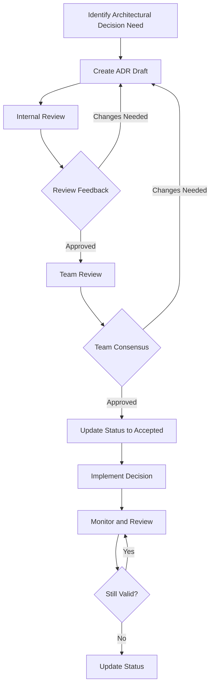

# ADR Review and Approval Process

This document outlines the process for creating, reviewing, and approving Architectural Decision Records (ADRs) for the Tux Discord bot project.

## Process Overview

## Roles and Responsibilities

### ADR Author

- Identifies need for architectural decision
- Creates initial ADR draft using template
- Incorporates feedback from reviews
- Updates ADR status based on team decisions
- Ensures implementation aligns with approved ADR

### Technical Reviewers

- Review ADR for technical accuracy and completeness
- Evaluate alternatives and trade-offs
- Provide feedback on implementation approach
- Validate alignment with existing architecture

### Architecture Team

- Final approval authority for ADRs
- Ensures consistency across architectural decisions
- Resolves conflicts between ADRs
- Maintains architectural vision and principles

### Development Team

- Provides input on implementation feasibility
- Reviews ADRs for development impact
- Participates in consensus building
- Implements approved architectural decisions

## ADR Lifecycle

### 1. Identification Phase

**Triggers for ADR Creation:**

- Significant architectural changes or additions
- Technology stack decisions
- Design pattern standardization
- Performance or scalability concerns
- Security or compliance requirements
- Cross-cutting concerns affecting multiple modules

**Who Can Initiate:**

- Any team member can identify the need for an ADR
- Architecture team may request ADRs for specific decisions
- ADRs may be required as part of feature planning

### 2. Creation Phase

**Steps:**

1. Use the ADR template (`template.md`) as starting point
2. Assign next available ADR number
3. Fill out all required sections thoroughly
4. Include relevant code examples and diagrams
5. Research and document alternatives considered
6. Set initial status to "Proposed"

**Quality Criteria:**

- Clear problem statement and context
- Specific, actionable decision
- Comprehensive alternatives analysis
- Realistic implementation plan
- Identified consequences and trade-offs

### 3. Review Phase

#### Internal Review (Author + 1-2 Technical Reviewers)

**Duration:** 2-3 business days
**Focus Areas:**

- Technical accuracy and completeness
- Clarity of problem statement and solution
- Feasibility of implementation approach
- Alignment with existing architecture

**Deliverables:**

- Review comments and suggestions
- Approval to proceed to team review or request for changes

#### Team Review (All Development Team Members)

**Duration:** 3-5 business days
**Process:**

1. ADR shared with entire development team
2. Team members provide feedback via comments or discussion
3. Author addresses feedback and updates ADR as needed
4. Team discussion meeting if consensus is unclear

**Focus Areas:**

- Implementation impact and effort
- Integration with existing systems
- Developer experience implications
- Resource and timeline requirements

### 4. Decision Phase

**Consensus Building:**

- Team discussion to address concerns and questions
- Author updates ADR based on feedback
- Final team vote or consensus confirmation
- Architecture team final approval

**Possible Outcomes:**

- **Accepted**: ADR approved for implementation
- **Rejected**: ADR not approved, document reasons
- **Deferred**: Decision postponed, specify conditions for reconsideration

### 5. Implementation Phase

**Responsibilities:**

- Author ensures implementation follows ADR guidelines
- Development team implements according to ADR specifications
- Code reviews verify compliance with ADR decisions
- Progress tracked against ADR implementation plan

**Monitoring:**

- Regular check-ins on implementation progress
- Validation that implementation matches ADR intent
- Documentation of any deviations or issues encountered

### 6. Maintenance Phase

**Ongoing Responsibilities:**

- Periodic review of ADR relevance and accuracy
- Updates to reflect implementation learnings
- Status changes if decisions become obsolete
- Creation of superseding ADRs when needed

## Review Criteria

### Technical Criteria

- [ ] Problem clearly defined with sufficient context
- [ ] Decision is specific and actionable
- [ ] Alternatives thoroughly evaluated
- [ ] Implementation approach is feasible
- [ ] Consequences realistically assessed
- [ ] Integration points identified
- [ ] Performance impact considered

### Process Criteria

- [ ] Template sections completed appropriately
- [ ] Related ADRs and requirements referenced
- [ ] Compliance mechanisms defined
- [ ] Success criteria measurable
- [ ] Timeline and dependencies realistic

### Quality Criteria

- [ ] Writing is clear and concise
- [ ] Technical details are accurate
- [ ] Examples and diagrams helpful
- [ ] Rationale is compelling
- [ ] Trade-offs honestly presented

## Approval Authority

### Standard ADRs

- **Technical Reviewers**: 2 approvals required
- **Team Consensus**: Majority agreement (no strong objections)
- **Architecture Team**: Final approval required

### High-Impact ADRs

- **Extended Review**: Additional stakeholder input
- **Architecture Team**: Unanimous approval required
- **External Review**: May require input from other teams

### Emergency ADRs

- **Fast Track**: Reduced review timeline for urgent decisions
- **Post-Implementation Review**: Full review after emergency implementation
- **Documentation**: Extra documentation of emergency rationale

## Status Management

### Status Transitions

- **Proposed** → **Accepted**: After successful review and approval
- **Proposed** → **Rejected**: If team decides against the proposal
- **Accepted** → **Deprecated**: When decision is no longer relevant
- **Accepted** → **Superseded**: When replaced by newer ADR
- **Any Status** → **Proposed**: When significant changes require re-review

### Status Tracking

- Update ADR index when status changes
- Notify team of status changes
- Archive deprecated/superseded ADRs appropriately
- Maintain history of status changes

## Tools and Templates

### Required Tools

- Git for version control and collaboration
- Markdown editor for ADR creation
- Issue tracking for ADR discussions
- Documentation platform for publishing

### Templates and Checklists

- [ADR Template](template.md) - Standard format for all ADRs
- Review Checklist - Criteria for evaluating ADRs
- Implementation Checklist - Tracking implementation progress

## Best Practices

### For Authors

- Start with clear problem statement
- Research thoroughly before proposing solution
- Be honest about trade-offs and limitations
- Include concrete examples where helpful
- Respond promptly to review feedback

### For Reviewers

- Focus on technical merit and feasibility
- Provide constructive, specific feedback
- Consider long-term implications
- Validate against existing architecture
- Participate actively in discussions

### For the Team

- Treat ADRs as living documents
- Update ADRs when implementation reveals new information
- Reference ADRs in code reviews and discussions
- Use ADRs for onboarding new team members
- Regularly review and maintain ADR collection

## Metrics and Continuous Improvement

### Success Metrics

- Time from proposal to decision
- Implementation success rate
- Team satisfaction with process
- Quality of architectural decisions
- Consistency of implementation

### Process Improvement

- Regular retrospectives on ADR process
- Feedback collection from participants
- Template and process refinements
- Tool and workflow optimizations
- Training and knowledge sharing

---

This process ensures that architectural decisions are well-considered, properly documented, and effectively implemented while maintaining team collaboration and technical excellence.
