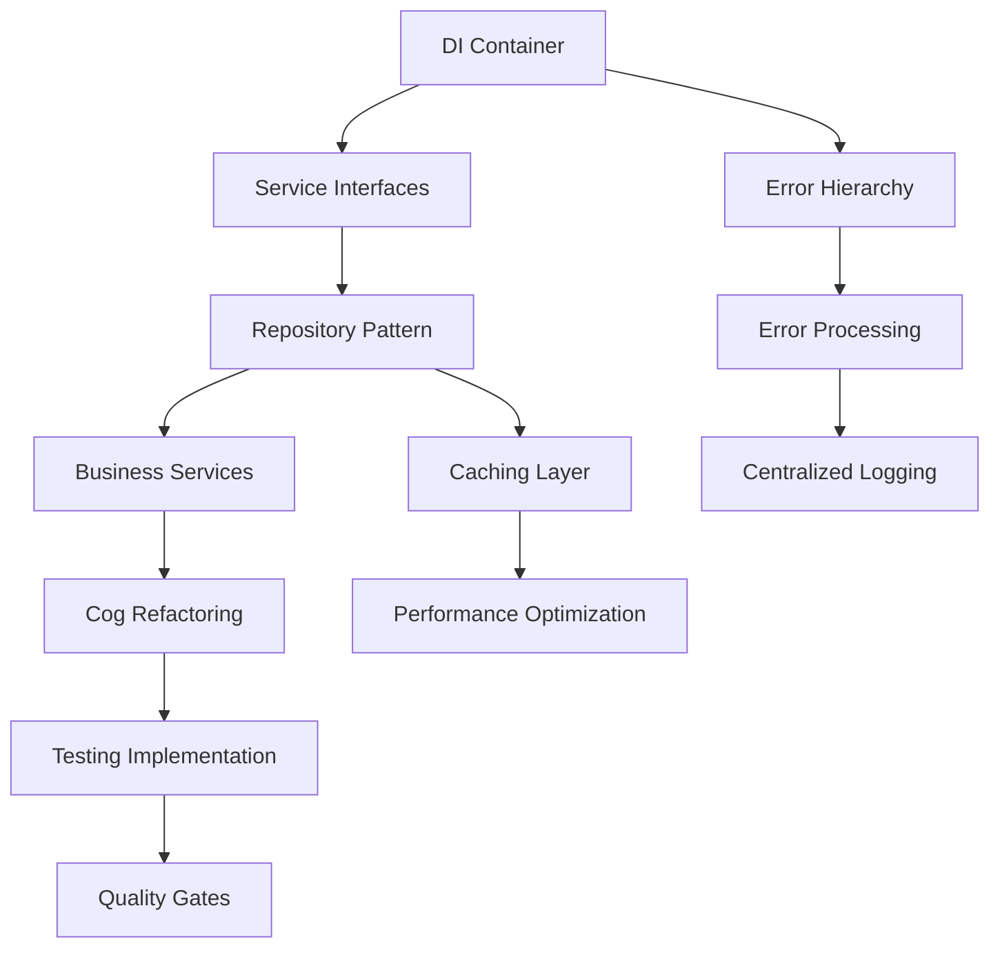

# Codebase Improvement Roadmap and Priorities

## Executive Summary

This document outlines a comprehensive roadmap for improving the Tux Discord bot codebase based on the analysis and design work completed in previous phases. The roadmap prioritizes improvements based on impact, effort, and dependencies to ensure maximum value delivery while minimizing risk.

## Implementation Timeline

### Phase 1: Foundation and Infrastructure (Weeks 1-4)

**Duration**: 4 weeks  
**Priority**: Critical  
**Risk Level**: Medium

#### Week 1-2: Core Infrastructure Setup

- **Task 1.1**: Implement dependency injection container
  - **Effort**: High (3-4 days)
  - **Impact**: High
  - **Dependencies**: None
  - **Deliverables**: Service container, basic DI patterns

- **Task 1.2**: Create base service interfaces
  - **Effort**: Medium (2-3 days)
  - **Impact**: High
  - **Dependencies**: Task 1.1
  - **Deliverables**: Core service contracts, interface definitions

#### Week 3-4: Error Handling Foundation

- **Task 1.3**: Implement structured error hierarchy
  - **Effort**: Medium (2-3 days)
  - **Impact**: High
  - **Dependencies**: Task 1.1
  - **Deliverables**: Error classes, exception handling framework

- **Task 1.4**: Create centralized error processing
  - **Effort**: Medium (2-3 days)
  - **Impact**: High
  - **Dependencies**: Task 1.3
  - **Deliverables**: Error middleware, logging integration

### Phase 2: Data Access Layer Improvements (Weeks 5-8)

**Duration**: 4 weeks  
**Priority**: High  
**Risk Level**: Medium-High

#### Week 5-6: Repository Pattern Implementation

- **Task 2.1**: Design and implement repository interfaces
  - **Effort**: High (4-5 days)
  - **Impact**: High
  - **Dependencies**: Task 1.2
  - **Deliverables**: Repository contracts, base implementations

- **Task 2.2**: Implement unit of work pattern
  - **Effort**: Medium (2-3 days)
  - **Impact**: Medium
  - **Dependencies**: Task 2.1
  - **Deliverables**: Transaction management, rollback mechanisms

#### Week 7-8: Database Access Optimization

- **Task 2.3**: Implement caching layer
  - **Effort**: Medium (3-4 days)
  - **Impact**: Medium
  - **Dependencies**: Task 2.1
  - **Deliverables**: Cache abstraction, invalidation strategies

- **Task 2.4**: Optimize existing database queries
  - **Effort**: High (4-5 days)
  - **Impact**: Medium
  - **Dependencisk 2.1, 2.2
  - **Deliverables**: Query optimization, performance improvements

### Phase 3: Service Layer Architecture (Weeks 9-12)

**Duration**: 4 weeks  
**Priority**: High  
**Risk Level**: Medium

#### Week 9-10: Business Logic Extraction

- **Task 3.1**: Create core business services
  - **Effort**: High (5-6 days)
  - **Impact**: High
  - **Dependencies**: Task 1.1, 1.2, 2.1
  - **Deliverables**: Service implementations, business logic separation

- **Task 3.2**: Implement service orchestration
  - **Effort**: Medium (3-4 days)
  - **Impact**: Medium
  - **Dependencies**: Task 3.1
  - **Deliverables**: Workflow coordination, service composition

#### Week 11-12: Cog Refactoring

- **Task 3.3**: Refactor high-priority cogs to use services
  - **Effort**: High (6-7 days)
  - **Impact**: High
  - **Dependencies**: Task 3.1, 3.2
  - **Deliverables**: Refactored cogs, reduced coupling

- **Task 3.4**: Update remaining cogs incrementally
  - **Effort**: High (5-6 days)
  - **Impact**: Medium
  - **Dependencies**: Task 3.3
  - **Deliverables**: All cogs using new architecture

### Phase 4: Common Functionality and Utilities (Weeks 13-16)

**Duration**: 4 weeks  
**Priority**: Medium  
**Risk Level**: Low

#### Week 13-14: Shared Components

- **Task 4.1**: Implement centralized embed factory
  - **Effort**: Medium (2-3 days)
  - **Impact**: Medium
  - **Dependencies**: Task 1.1
  - **Deliverables**: Embed utilities, consistent UI components

- **Task 4.2**: Create validation utilities
  - **Effort**: Medium (2-3 days)
  - **Impact**: Medium
  - **Dependencies**: Task 1.3
  - **Deliverables**: Input validation, sanitization utilities

#### Week 15-16: Code Duplication Elimination

- **Task 4.3**: Extract common patterns into utilities
  - **Effort**: Medium (3-4 days)
  - **Impact**: Medium
  - **Dependencies**: Task 4.1, 4.2
  - **Deliverables**: Utility libraries, reduced duplication

- **Task 4.4**: Standardize response handling
  - **Effort**: Low (1-2 days)
  - **Impact**: Low
  - **Dependencies**: Task 4.1, 4.3
  - **Deliverables**: Response utilities, consistent formatting

### Phase 5: Testing and Quality Assurance (Weeks 17-20)

**Duration**: 4 weeks  
**Priority**: High  
**Risk Level**: Low

#### Week 17-18: Test Infrastructure

- **Task 5.1**: Implement comprehensive unit testing
  - **Effort**: High (5-6 days)
  - **Impact**: High
  - **Dependencies**: All previous phases
  - **Deliverables**: Test suite, coverage reports

- **Task 5.2**: Create integration testing framework
  - **Effort**: Medium (3-4 days)
  - **Impact**: Medium
  - **Dependencies**: Task 5.1
  - **Deliverables**: Integration tests, test utilities

#### Week 19-20: Quality Tools and Processes

- **Task 5.3**: Integrate static analysis tools
  - **Effort**: Low (1-2 days)
  - **Impact**: Medium
  - **Dependencies**: Task 5.1
  - **Deliverables**: Linting, type checking, quality gates

- **Task 5.4**: Implement performance testing
  - **Effort**: Medium (2-3 days)
  - **Impact**: Medium
  - **Dependencies**: Task 5.2
  - **Deliverables**: Performance benchmarks, monitoring

### Phase 6: Security and Monitoring (Weeks 21-24)

**Duration**: 4 weeks  
**Priority**: Medium  
**Risk Level**: Low

#### Week 21-22: Security Enhancements

- **Task 6.1**: Standardize input validation
  - **Effort**: Medium (3-4 days)
  - **Impact**: High
  - **Dependencies**: Task 4.2
  - **Deliverables**: Security utilities, validation framework

- **Task 6.2**: Improve permission system
  - **Effort**: Medium (2-3 days)
  - **Impact**: Medium
  - **Dependencies**: Task 3.1
  - **Deliverables**: Permission abstractions, security checks

#### Week 23-24: Observability Improvements

- **Task 6.3**: Enhance monitoring and metrics
  - **Effort**: Medium (3-4 days)
  - **Impact**: Medium
  - **Dependencies**: Task 1.4
  - **Deliverables**: Metrics collection, dashboards

- **Task 6.4**: Improve logging and tracing
  - **Effort**: Low (1-2 days)
  - **Impact**: Low
  - **Dependencies**: Task 6.3
  - **Deliverables**: Structured logging, trace correlation

## Priority Matrix

### High Impact, Low Effort (Quick Wins)

1. **Centralized embed factory** - Immediate UI consistency improvement
2. **Error message standardization** - Better user experience
3. **Static analysis integration** - Automated quality improvements
4. **Input validation utilities** - Security and reliability gains

### High Impact, High Effort (Major Initiatives)

1. **Dependency injection implementation** - Foundation for all improvements
2. **Service layer architecture** - Core architectural improvement
3. **Repository pattern implementation** - Data access standardization
4. **Comprehensive testing suite** - Quality assurance foundation

### Low Impact, Low Effort (Nice to Have)

1. **Response handling standardization** - Minor consistency improvement
2. **Logging enhancements** - Incremental observability gains
3. **Documentation updates** - Developer experience improvement
4. **Performance monitoring** - Operational visibility

### Low Impact, High Effort (Avoid/Defer)

1. **Complete codebase rewrite** - High risk, questionable value
2. **Advanced caching strategies** - Premature optimization
3. **Microservices architecture** - Unnecessary complexity
4. **Custom ORM implementation** - Reinventing the wheel

## Dependencies and Critical Path

### Critical Path Analysis

The following tasks form the critical path and must be completed in sequence:

1. **Dependency Injection Container** → **Service Interfaces** → **Business Services** → **Cog Refactoring**
2. **Error Hierarchy** → **Error Processing** → **User-Friendly Messages**
3. **Repository Interfaces** → **Unit of Work** → **Database Optimization**

### Dependency Relationships

### Parallel Work Streams

The following tasks can be executed in parallel:

- **Stream 1**: DI Container → Service Layer → Cog Refactoring
- **Stream 2**: Error Handling → Logging → Monitoring
- **Stream 3**: Repository Pattern → Caching → Performance
- **Stream 4**: Utilities → Testing → Quality Tools

## Risk Assessment and Mitigation Strategies

### High-Risk Areas

#### 1. Dependency Injection Implementation

**Risk Level**: High  
**Impact**: Critical system functionality  
**Probability**: Medium

**Mitigation Strategies**:

- Start with simple, well-tested DI container
- Implement comprehensive unit tests before integration
- Use feature flags for gradual rollout
- Maintain backward compatibility during transition
- Create rollback procedures for each milestone

#### 2. Database Layer Refactoring

**Risk Level**: Medium-High  
**Impact**: Data integrity and performance  
**Probability**: Medium

**Mitigation Strategies**:

- Implement repository pattern alongside existing controllers
- Use adapter pattern to bridge old and new implementations
- Extensive integration testing with real data
- Performance benchmarking before and after changes
- Database backup and recovery procedures

#### 3. Service Layer Architecture

**Risk Level**: Medium  
**Impact**: Business logic correctness  
**Probability**: Low

**Mitigation Strategies**:

- Extract services incrementally, one domain at a time
- Maintain existing cog functionality during transition
- Comprehensive business logic testing
- Pair programming for complex business rules
- Code review requirements for service implementations

### Medium-Risk Areas

#### 1. Cog Refactoring

**Risk Level**: Medium  
**Impact**: Feature functionality  
**Probability**: Medium

**Mitigation Strategies**:

- Refactor cogs in order of complexity (simple first)
- Maintain feature parity during refactoring
- User acceptance testing for each refactored cog
- Staged deployment with monitoring
- Quick rollback capabilities

#### 2. Testing Implementation

**Risk Level**: Medium  
**Impact**: Quality assurance  
**Probability**: Low

**Mitigation Strategies**:

- Start with high-value, low-complexity tests
- Use test-driven development for new features
- Implement continuous integration early
- Regular test suite maintenance and updates
- Performance testing for critical paths

### Low-Risk Areas

#### 1. Utility Functions and Common Code

**Risk Level**: Low  
**Impact**: Developer productivity  
**Probability**: Low

**Mitigation Strategies**:

- Implement utilities as optional enhancements
- Maintain backward compatibility with existing patterns
- Gradual adoption across the codebase
- Documentation and examples for new utilities

#### 2. Monitoring and Observability

**Risk Level**: Low  
**Impact**: Operational visibility  
**Probability**: Low

**Mitigation Strategies**:

- Implement monitoring as additive features
- Ensure monitoring doesn't impact performance
- Gradual rollout of new monitoring capabilities
- Fallback to existing monitoring during issues

## Success Metrics and Validation

### Code Quality Metrics

- **Code Duplication**: Reduce by 60% (measured by SonarQube)
- **Cyclomatic Complexity**: Reduce average complexity by 40%
- **Test Coverage**: Achieve 80% line coverage, 90% branch coverage
- **Technical Debt**: Reduce debt ratio by 50% (SonarQube metric)

### Performance Metrics

- **Response Time**: Maintain <200ms average response time
- **Memory Usage**: Reduce memory footprint by 20%
- **Database Queries**: Reduce N+1 queries by 90%
- **Error Rate**: Reduce unhandled errors by 80%

### Developer Experience Metrics

- **Build Time**: Maintain <30 seconds for full test suite
- **Onboarding Time**: Reduce new developer onboarding to <2 days
- **Feature Development**: Reduce average feature development time by 30%
- **Bug Resolution**: Reduce average bug resolution time by 40%

### Operational Metrics

- **Deployment Frequency**: Enable daily deployments
- **Mean Time to Recovery**: Reduce MTTR to <15 minutes
- **Change Failure Rate**: Maintain <5% change failure rate
- **Availability**: Maintain 99.9% uptime during improvements

## Resource Requirements

### Development Team

- **Senior Developer**: 1 FTE for architectural guidance
- **Mid-level Developers**: 2 FTE for implementation work
- **Junior Developer**: 1 FTE for testing and documentation
- **DevOps Engineer**: 0.5 FTE for CI/CD and deployment

### Infrastructure

- **Development Environment**: Enhanced with testing tools
- **Staging Environment**: Mirror production for integration testing
- **Monitoring Tools**: Enhanced observability stack
- **Testing Infrastructure**: Automated testing pipeline

### Timeline and Budget

- **Total Duration**: 24 weeks (6 months)
- **Development Effort**: ~400 person-days
- **Infrastructure Costs**: Estimated 20% increase during transition
- **Training and Documentation**: 40 person-days

## Conclusion

This roadmap provides a structured approach to improving the Tux Discord bot codebase while minimizing risk and maximizing value delivery. The phased approach ensures that foundational improvements are completed first, enabling subsequent improvements to build upon a solid foundation.

Key success factors include:

- Maintaining system stability throughout the process
- Comprehensive testing at each phase
- Clear communication and documentation
- Regular progress monitoring and adjustment
- Strong focus on developer experience and productivity

The roadmap is designed to be flexible and adaptable, allowing for adjustments based on lessons learned and changing priorities while maintaining focus on the core objectives of improved code quality, maintainability, and developer experience.
