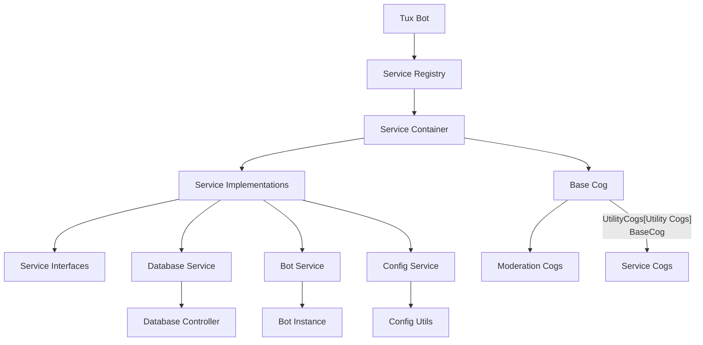
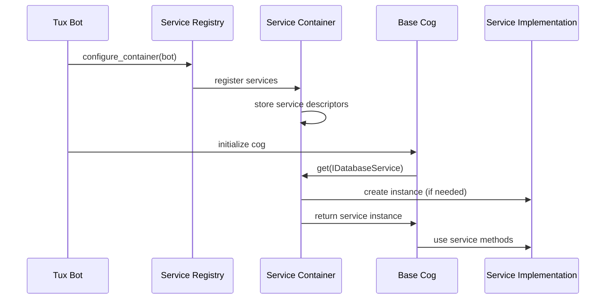

# Design Document

## Overview

The dependency injection system will transform the Tux Discord bot architecture from a tightly-coupled design with 35+ direct database instantiations to a modern, loosely-coupled architecture using dependency injection patterns. The system will provide a lightweight service container, well-defined interfaces, and automatic dependency resolution while maintaining full backward compatibility.

## Architecture

### High-Level Architecture



### Service Lifecycle Management



## Components and Interfaces

### 1. Service Container (`tux/core/container.py`)

**Purpose:** Lightweight dependency injection container that manages service lifecycles and resolves dependencies.

**Key Features:**
- Support for singleton, transient, and scoped lifetimes
- Automatic constructor dependency injection
- Type-safe service resolution
- Error handling and logging
- Performance optimization for singleton caching

**Public API:**
```python
class ServiceContainer:
    def register_singleton(self, service_type: type[T], implementation: type[T] | None = None) -> ServiceContainer
    def register_transient(self, service_type: type[T], implementation: type[T] | None = None) -> ServiceContainer
    def register_instance(self, service_type: type[T], instance: T) -> ServiceContainer
    def get(self, service_type: type[T]) -> T
    def get_optional(self, service_type: type[T]) -> T | None
    def is_registered(self, service_type: type[T]) -> bool
```

### 2. Service Interfaces (`tux/core/interfaces.py`)

**Purpose:** Define contracts for services using Python protocols for type safety and testability.

**Core Interfaces:**
- `IDatabaseService`: Database operations and controller access
- `IBotService`: Bot instance operations and properties
- `IConfigService`: Configuration value access
- `ILoggingService`: Centralized logging operations (future extension)

**Design Principles:**
- Protocol-based for structural typing
- Minimal, focused interfaces
- Clear method signatures with type hints
- Comprehensive docstrings

### 3. Service Implementations (`tux/core/services.py`)

**Purpose:** Concrete implementations of service interfaces that wrap existing functionality.

**Implementation Strategy:**
- Wrap existing components (DatabaseController, Config, etc.)
- Maintain backward compatibility
- Add error handling and logging
- Provide clean abstractions

**Service Implementations:**
- `DatabaseService`: Wraps DatabaseController, provides query execution
- `BotService`: Wraps bot instance, provides user/emoji access
- `ConfigService`: Wraps Config utilities, provides configuration access

### 4. Service Registry (`tux/core/service_registry.py`)

**Purpose:** Central configuration point for all service registrations.

**Responsibilities:**
- Configure service container with all required services
- Manage service lifetimes and dependencies
- Provide factory methods for different environments (production, testing)
- Handle service registration errors

**Configuration Strategy:**
```python
@staticmethod
def configure_container(bot: Tux) -> ServiceContainer:
    container = ServiceContainer()
    
    # Core services as singletons
    container.register_singleton(IDatabaseService, DatabaseService)
    container.register_singleton(IConfigService, ConfigService)
    
    # Bot-dependent services
    container.register_instance(IBotService, BotService(bot))
    
    return container
```

### 5. Enhanced Base Cog (`tux/core/base_cog.py`)

**Purpose:** Base class for all cogs with automatic dependency injection and backward compatibility.

**Key Features:**
- Automatic service injection through constructor
- Fallback to direct instantiation for compatibility
- Backward-compatible property access
- Error handling for missing services

**Injection Strategy:**
```python
def __init__(self, bot: Tux) -> None:
    self.bot = bot
    self._container = getattr(bot, 'container', None)
    
    if self._container:
        self.db_service = self._container.get_optional(IDatabaseService)
        self.bot_service = self._container.get_optional(IBotService)
        self.config_service = self._container.get_optional(IConfigService)
    else:
        self._init_fallback_services()
```

### 6. Bot Integration (`tux/bot.py`)

**Purpose:** Initialize dependency injection container during bot startup.

**Integration Points:**
- Container initialization in `setup()` method
- Service registration before cog loading
- Error handling for initialization failures
- Container availability for cogs

## Data Models

### Service Descriptor

```python
@dataclass
class ServiceDescriptor:
    service_type: type
    implementation_type: type
    lifetime: ServiceLifetime
    factory: Callable | None = None
    instance: Any | None = None
```

### Service Lifetime Enumeration

```python
class ServiceLifetime(Enum):
    SINGLETON = "singleton"    # One instance per container
    TRANSIENT = "transient"    # New instance per request
    SCOPED = "scoped"         # One instance per scope (future)
```

## Error Handling

### Error Categories

1. **Registration Errors:**
   - Duplicate service registration
   - Invalid service types
   - Circular dependencies

2. **Resolution Errors:**
   - Unregistered service requests
   - Constructor injection failures
   - Type mismatch errors

3. **Runtime Errors:**
   - Service initialization failures
   - Dependency unavailability
   - Container corruption

### Error Handling Strategy

```python
class ServiceRegistrationError(Exception):
    """Raised when service registration fails."""
    pass

class ServiceResolutionError(Exception):
    """Raised when service resolution fails."""
    pass

# Error handling in container
def get(self, service_type: type[T]) -> T:
    try:
        return self._resolve_service(service_type)
    except Exception as e:
        logger.error(f"Failed to resolve {service_type.__name__}: {e}")
        raise ServiceResolutionError(f"Cannot resolve {service_type.__name__}") from e
```

### Fallback Mechanisms

1. **Container Unavailable:** Cogs fall back to direct instantiation
2. **Service Unavailable:** Use optional injection with None checks
3. **Injection Failure:** Graceful degradation with logging
4. **Backward Compatibility:** Maintain existing property access patterns

## Testing Strategy

### Unit Testing Approach

1. **Service Container Testing:**
   - Registration and resolution functionality
   - Lifecycle management
   - Error conditions
   - Performance characteristics

2. **Service Implementation Testing:**
   - Interface compliance
   - Functionality preservation
   - Error handling
   - Integration with existing components

3. **Cog Testing with Mocking:**
   - Mock service injection
   - Behavior verification
   - Fallback mechanism testing
   - Backward compatibility validation

### Integration Testing

1. **Full System Integration:**
   - Bot startup with container initialization
   - Service registration and resolution
   - Cog loading with dependency injection
   - End-to-end functionality verification

2. **Migration Testing:**
   - Before/after behavior comparison
   - Performance impact measurement
   - Compatibility verification
   - Error scenario handling

### Testing Infrastructure

```python
# Test fixtures for dependency injection
@pytest.fixture
def mock_container():
    container = ServiceContainer()
    container.register_instance(IDatabaseService, MockDatabaseService())
    container.register_instance(IBotService, MockBotService())
    return container

@pytest.fixture
def mock_bot_with_container(mock_container):
    bot = Mock()
    bot.container = mock_container
    return bot
```

## Performance Considerations

### Optimization Strategies

1. **Singleton Caching:** Cache singleton instances for fast repeated access
2. **Lazy Initialization:** Create services only when first requested
3. **Type Hint Caching:** Cache reflection results for constructor injection
4. **Minimal Overhead:** Keep container operations lightweight

### Performance Targets

- Service resolution: < 1ms for first access, < 0.1ms for cached singletons
- Memory overhead: < 5% increase in total memory usage
- Startup time: No measurable increase in bot startup time
- Runtime performance: No degradation in command execution time

### Monitoring and Metrics

```python
# Performance monitoring in container
def get(self, service_type: type[T]) -> T:
    start_time = time.perf_counter()
    try:
        result = self._resolve_service(service_type)
        resolution_time = time.perf_counter() - start_time
        logger.debug(f"Resolved {service_type.__name__} in {resolution_time:.4f}s")
        return result
    except Exception as e:
        logger.error(f"Resolution failed for {service_type.__name__}: {e}")
        raise
```

## Migration Strategy

### Phase-Based Migration

1. **Phase 1: Infrastructure (Weeks 1-2)**
   - Implement service container and interfaces
   - Create service implementations
   - Set up service registry
   - Add bot integration

2. **Phase 2: Base Cog Enhancement (Week 3)**
   - Enhance BaseCog with dependency injection
   - Add fallback mechanisms
   - Implement backward compatibility

3. **Phase 3: Cog Migration (Weeks 4-7)**
   - Migrate cogs in batches by category
   - Maintain functionality during migration
   - Validate each batch before proceeding

4. **Phase 4: Cleanup and Optimization (Week 8)**
   - Remove unused direct instantiations
   - Optimize performance
   - Complete testing and documentation

### Backward Compatibility Strategy

1. **Gradual Migration:** Support both old and new patterns during transition
2. **Fallback Mechanisms:** Ensure cogs work without dependency injection
3. **Property Preservation:** Maintain existing property access patterns
4. **Error Tolerance:** Handle missing services gracefully

### Validation and Rollback

1. **Automated Validation:** Scripts to verify migration completeness
2. **Performance Monitoring:** Continuous monitoring during migration
3. **Rollback Plan:** Ability to revert changes if issues arise
4. **Testing Gates:** Comprehensive testing before each phase

This design provides a robust foundation for dependency injection while ensuring smooth migration and maintaining system reliability.
