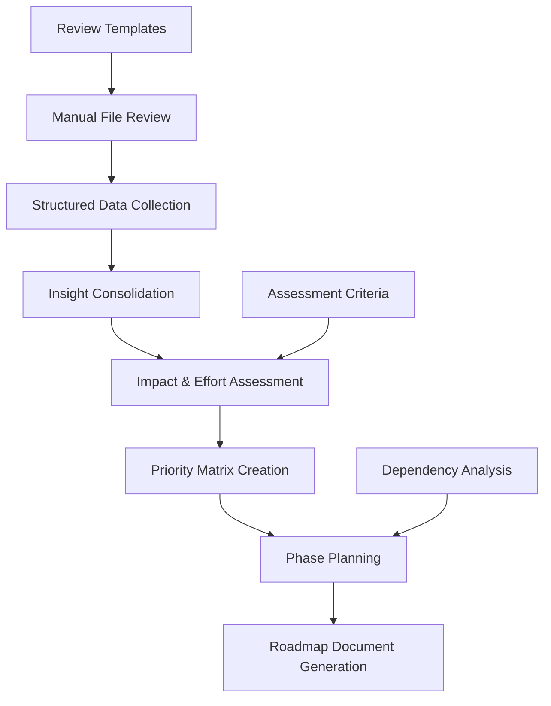

# Design Document

## Overview

This design document outlines the approach for creating a priority implementation roadmap based on comprehensive manual analysis of the Tux Discord bot codebase audit. The process will involve systematically reviewing 70+ audit files containing diverse insights, recommendations, and improvement strategies to generate a structured, prioritized action plan for development teams.

**Key Challenge**: The audit files are highly heterogeneous, including structured analysis reports, Python implementation files, configuration guides, executive summaries, and strategy documents. Rather than attempting automated parsing of these diverse formats, this design takes a human-driven approach with structured templates and systematic review processes.

## Architecture

### High-Level Approach



### Process Components

The roadmap creation process consists of six main phases:

1. **Manual File Review**: Systematic review of audit files using structured templates
2. **Structured Data Collection**: Recording insights using standardized formats
3. **Insight Consolidation**: Grouping and deduplicating related findings
4. **Impact & Effort Assessment**: Evaluating each improvement using defined criteria
5. **Priority Matrix Creation**: Ranking improvements using impact/effort methodology
6. **Roadmap Document Generation**: Creating the final structured implementation plan

## Components and Interfaces

### 1. Manual File Review Process

**Purpose**: Systematically review each audit file to extract actionable insights and recommendations.

**Review Categories**:
- **Analysis Reports**: Files like `01_codebase_audit_report.md`, `09_code_duplication_analysis.md`
- **Implementation Files**: Python files like `21_migration_cli.py` with actual tools
- **Configuration Guides**: Files like `33_static_analysis_integration_config.md` with setup instructions
- **Executive Reports**: Files like `62_executive_summary.md` with metrics and assessments
- **Strategy Documents**: Files like `23_service_layer_architecture_plan.md` with implementation plans

**Review Template**:
```markdown
## File Review: [filename]

### File Type: [Analysis/Implementation/Configuration/Executive/Strategy]

### Key Insights:
- Insight 1: [Description]
- Insight 2: [Description]
- ...

### Recommendations:
- Recommendation 1: [Description with impact/effort notes]
- Recommendation 2: [Description with impact/effort notes]
- ...

### Quantitative Data:
- Metric 1: [Value and context]
- Metric 2: [Value and context]
- ...

### Implementation Details:
- [Specific steps, dependencies, or technical requirements]

### Source References:
- File: [filename]
- Sections: [relevant sections]
```

### 2. Structured Data Collection

**Purpose**: Record extracted insights in a standardized format for analysis and prioritization.

**Data Collection Template**:
```markdown
## Improvement Item: [ID]

### Title: [Clear, actionable title]

### Description: 
[Detailed description of the improvement]

### Category: 
[Architecture/Performance/Code Quality/Security/Developer Experience/Infrastructure]

### Source Files:
- [List of audit files that mention this improvement]

### Affected Components:
- [List of codebase areas that would be impacted]

### Problem Statement:
[Clear description of the current issue or opportunity]

### Proposed Solution:
[Specific approach to address the problem]

### Success Metrics:
- [Measurable outcomes that indicate success]

### Dependencies:
- [Other improvements that must be completed first]

### Risk Factors:
- [Potential challenges or risks in implementation]
```

### 3. Insight Consolidation

**Purpose**: Group related findings and eliminate duplicates across multiple audit files.

**Consolidation Process**:
1. **Theme Identification**: Group insights by common themes (e.g., "Database Controller Duplication")
2. **Duplicate Detection**: Identify insights that address the same underlying issue
3. **Content Merging**: Combine related insights into comprehensive improvement items
4. **Source Tracking**: Maintain references to all original audit files

**Consolidation Template**:
```markdown
## Consolidated Improvement: [ID]

### Primary Theme: [Main improvement area]

### Related Insights:
- From [file1]: [insight summary]
- From [file2]: [insight summary]
- From [file3]: [insight summary]

### Unified Description:
[Comprehensive description combining all related insights]

### Combined Impact:
[Assessment considering all related findings]

### Implementation Scope:
[Full scope considering all related aspects]
```

### 4. Impact & Effort Assessment

**Purpose**: Evaluate each improvement using standardized criteria for business impact and implementation effort.

**Impact Assessment Criteria**:
- **User Experience** (1-10): How much will this improve user-facing functionality?
- **Developer Productivity** (1-10): How much will this improve development speed/ease?
- **System Reliability** (1-10): How much will this improve system stability/monitoring?
- **Technical Debt Reduction** (1-10): How much will this reduce maintenance burden?

**Effort Assessment Criteria**:
- **Technical Complexity** (1-10): How difficult is the implementation?
- **Dependencies** (1-10): How many prerequisites or integrations are required?
- **Risk Level** (1-10): How likely are breaking changes or complications?
- **Resource Requirements** (1-10): How much time/expertise is needed?

**Assessment Template**:
```markdown
## Assessment: [Improvement ID]

### Impact Scores:
- User Experience: [1-10] - [Justification]
- Developer Productivity: [1-10] - [Justification]
- System Reliability: [1-10] - [Justification]
- Technical Debt Reduction: [1-10] - [Justification]
- **Overall Impact**: [Average score]

### Effort Scores:
- Technical Complexity: [1-10] - [Justification]
- Dependencies: [1-10] - [Justification]
- Risk Level: [1-10] - [Justification]
- Resource Requirements: [1-10] - [Justification]
- **Overall Effort**: [Average score]

### Priority Calculation:
- Impact: [score] / Effort: [score] = Priority: [High/Medium/Low]
```

### 5. Priority Matrix Creation

**Purpose**: Rank all improvements using a systematic impact/effort matrix.

**Priority Matrix**:
```
                Low Effort    Medium Effort    High Effort
High Impact        HIGH          MEDIUM          MEDIUM
Medium Impact      MEDIUM        MEDIUM          LOW
Low Impact         LOW           LOW             LOW
```

**Priority Categories**:
- **HIGH**: High impact, low-to-medium effort (implement first)
- **MEDIUM**: High impact with high effort, or medium impact with low effort
- **LOW**: Low impact regardless of effort (implement last or defer)

### 6. Phase Planning

**Purpose**: Group improvements into logical implementation phases based on dependencies and themes.

**Phase Structure**:
- **Phase 1 (Months 1-2)**: Foundation improvements that enable other changes
- **Phase 2 (Months 2-4)**: Core architectural improvements
- **Phase 3 (Months 4-5)**: Performance and quality enhancements
- **Phase 4 (Months 5-6)**: Final optimizations and documentation

**Phase Planning Criteria**:
- Technical dependencies (prerequisite improvements)
- Logical groupings (related improvements together)
- Resource balancing (distribute effort across phases)
- Risk management (high-risk items with adequate buffer time)

## Data Models

### Core Data Structures

**Improvement Item**:
```markdown
- ID: Unique identifier
- Title: Clear, actionable title
- Description: Detailed explanation
- Category: Architecture/Performance/Code Quality/Security/Developer Experience/Infrastructure
- Priority: High/Medium/Low
- Impact Score: 1-10 overall score
- Effort Score: 1-10 overall score
- Source Files: List of audit files
- Affected Components: List of codebase areas
- Success Metrics: Measurable outcomes
- Dependencies: Prerequisites
- Phase: Implementation phase (1-4)
- Estimated Effort: Person-weeks/months
- Risk Level: High/Medium/Low
```

**Implementation Phase**:
```markdown
- Phase Number: 1-4
- Title: Phase name
- Duration: Months
- Theme: Primary focus area
- Improvements: List of improvement IDs
- Key Deliverables: Major outcomes
- Success Criteria: Completion metrics
- Resource Requirements: Team allocation
```

## Error Handling

### Quality Assurance Process

**Review Validation**:
- Each audit file reviewed by at least one person
- Spot checks on 20% of files by second reviewer
- Validation of extracted insights against original content

**Assessment Validation**:
- Impact/effort scores reviewed for consistency
- Priority rankings validated by technical experts
- Dependency analysis verified for logical correctness

**Output Validation**:
- Final roadmap reviewed by stakeholders
- Implementation phases validated for feasibility
- Resource estimates reviewed against available capacity

## Testing Strategy

### Manual Review Quality

**Consistency Checks**:
- Similar improvements scored consistently
- All major audit findings captured
- No significant insights overlooked

**Completeness Validation**:
- All 70+ audit files reviewed
- All recommendations categorized
- All quantitative data captured

**Accuracy Verification**:
- Sample of insights verified against source files
- Priority rankings validated by domain experts
- Timeline estimates reviewed for realism

## Implementation Approach

### Process Timeline

**Week 1: File Review and Data Collection**
- Review all 70+ audit files systematically
- Extract insights using structured templates
- Record findings in standardized format

**Week 2: Consolidation and Assessment**
- Consolidate related insights
- Eliminate duplicates
- Assess impact and effort for each improvement

**Week 3: Prioritization and Phase Planning**
- Create priority matrix
- Group improvements into implementation phases
- Analyze dependencies and resource requirements

**Week 4: Roadmap Generation and Validation**
- Generate final roadmap document
- Validate with stakeholders
- Refine based on feedback

### Quality Assurance

**Validation Checkpoints**:
- File review completeness (100% of files processed)
- Insight extraction accuracy (spot check validation)
- Priority scoring consistency (expert review)
- Phase planning feasibility (stakeholder validation)

**Success Criteria**:
- All audit insights captured and categorized
- Priority rankings validated by technical experts
- Implementation phases approved by stakeholders
- Resource estimates aligned with available capacity
