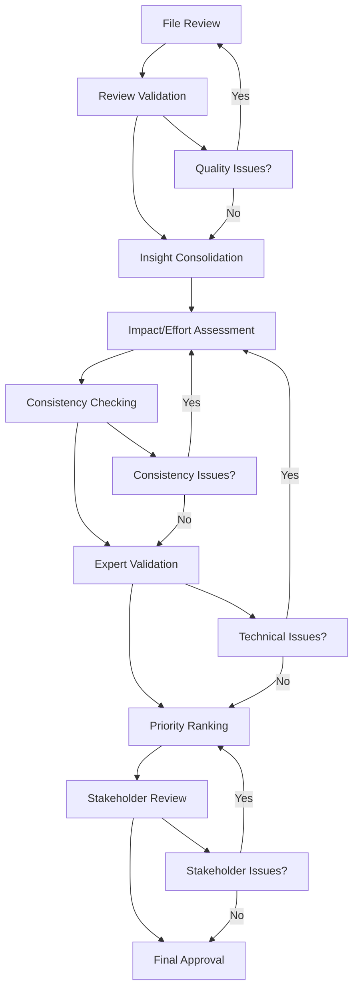

# Quality Assurance and Validation Processes

## Overview
This directory contains comprehensive quality assurance and validation processes for the priority implementation roadmap creation. These processes ensure accuracy, consistency, and stakeholder alignment throughout the analysis and roadmap development.

## Process Components

### 1. Review Validation Criteria (`review_validation_criteria.md`)
**Purpose**: Define validation criteria and checkpoints for comprehensive audit file analysis
**Key Features**:
- Completeness, quality, and accuracy criteria for file reviews
- Multi-stage validation checkpoints
- Quality metrics and remediation processes
- Success criteria for each validation level

### 2. Consistency Checking Procedures (`consistency_checking_procedures.md`)
**Purpose**: Ensure consistent assessment of impact and effort scores across all improvements
**Key Features**:
- Calibrated scoring standards for all assessment dimensions
- Statistical and qualitative consistency validation methods
- Inter-rater reliability procedures
- Remediation processes for inconsistencies

### 3. Expert Validation Process (`expert_validation_process.md`)
**Purpose**: Engage technical domain experts to validate priority rankings and technical accuracy
**Key Features**:
- Expert identification and role definitions
- Structured validation workflows and methods
- Technical accuracy and feasibility validation
- Expert consensus building processes

### 4. Stakeholder Review Process (`stakeholder_review_process.md`)
**Purpose**: Engage stakeholders to review and approve the final priority implementation roadmap
**Key Features**:
- Stakeholder identification and engagement methods
- Individual and group review processes
- Consensus building and approval documentation
- Post-approval implementation support

## Quality Assurance Framework

### Quality Dimensions

#### Accuracy
- **File Review Accuracy**: Extracted insights accurately reflect source content
- **Assessment Accuracy**: Impact/effort scores align with calibration standards
- **Technical Accuracy**: Technical assessments validated by domain experts
- **Business Accuracy**: Business impact assessments validated by stakeholders

#### Consistency
- **Review Consistency**: Similar files reviewed with consistent depth and quality
- **Assessment Consistency**: Similar improvements scored consistently
- **Process Consistency**: All procedures followed consistently across all work
- **Documentation Consistency**: All outputs follow established formats and standards

#### Completeness
- **Coverage Completeness**: All 70+ audit files processed and analyzed
- **Insight Completeness**: All significant insights extracted and documented
- **Assessment Completeness**: All improvements assessed across all dimensions
- **Validation Completeness**: All validation processes completed successfully

#### Stakeholder Alignment
- **Priority Alignment**: Priorities align with stakeholder expectations
- **Resource Alignment**: Resource requirements align with available capacity
- **Timeline Alignment**: Implementation timeline aligns with business needs
- **Success Alignment**: Success criteria align with organizational goals

### Quality Assurance Workflow

## Implementation Guidelines

### Phase 1: Setup and Calibration
1. **Review Process Training**: Train reviewers on validation criteria and templates
2. **Assessment Calibration**: Conduct calibration sessions for consistent scoring
3. **Expert Identification**: Identify and engage technical domain experts
4. **Stakeholder Alignment**: Confirm stakeholder roles and expectations

### Phase 2: Quality-Controlled Execution
1. **Systematic Review**: Execute file reviews with built-in validation checkpoints
2. **Continuous Monitoring**: Monitor quality metrics throughout the process
3. **Regular Calibration**: Maintain consistency through regular calibration checks
4. **Issue Resolution**: Address quality issues promptly and systematically

### Phase 3: Validation and Approval
1. **Expert Validation**: Engage experts for technical validation and priority review
2. **Stakeholder Engagement**: Conduct structured stakeholder review process
3. **Consensus Building**: Facilitate consensus on priorities and implementation approach
4. **Final Approval**: Secure formal stakeholder approval and commitment

## Quality Metrics Dashboard

### Process Metrics
- **File Review Progress**: % of files completed and validated
- **Assessment Progress**: % of improvements assessed and validated
- **Validation Progress**: % of validation processes completed
- **Stakeholder Engagement**: % of stakeholders engaged and committed

### Quality Metrics
- **Review Accuracy Rate**: % of file reviews passing validation (target: 95%+)
- **Assessment Consistency**: Inter-rater correlation for assessments (target: >0.8)
- **Expert Validation Score**: Expert rating of technical accuracy (target: >8/10)
- **Stakeholder Satisfaction**: Stakeholder rating of process and outcomes (target: >8/10)

### Outcome Metrics
- **Coverage Completeness**: % of audit insights captured (target: 90%+)
- **Priority Consensus**: % of stakeholder agreement on priorities (target: 80%+)
- **Implementation Readiness**: % of Phase 1 items ready for implementation (target: 100%)
- **Success Criteria Clarity**: % of improvements with clear success metrics (target: 100%)

## Success Criteria

### Process Success
- All quality assurance processes executed successfully
- All validation checkpoints passed with target metrics achieved
- All stakeholders engaged and committed to final roadmap
- Complete documentation of all decisions and rationale

### Quality Success
- 95%+ accuracy in file review and insight extraction
- 80%+ consistency in impact/effort assessments
- Expert validation of technical accuracy and feasibility
- Stakeholder approval of priorities and implementation plan

### Outcome Success
- Comprehensive priority implementation roadmap delivered
- Clear, actionable improvement items with validated priorities
- Stakeholder-approved implementation plan with committed resources
- Established success metrics and monitoring processes

## Continuous Improvement

### Process Improvement
- Regular review of quality assurance effectiveness
- Updates to procedures based on lessons learned
- Incorporation of stakeholder feedback into future processes
- Documentation of best practices and recommendations

### Quality Enhancement
- Refinement of validation criteria based on experience
- Improvement of consistency checking procedures
- Enhancement of expert and stakeholder engagement methods
- Development of better quality metrics and monitoring tools
