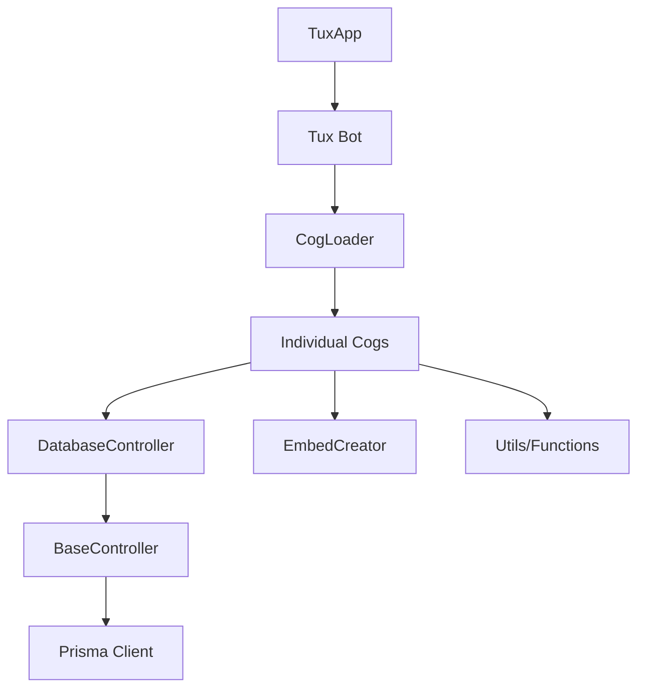
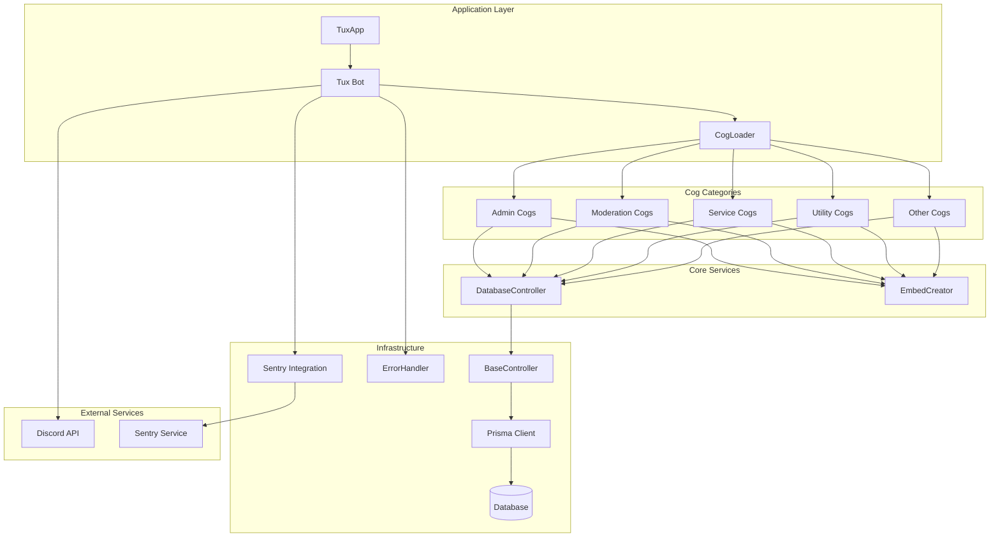
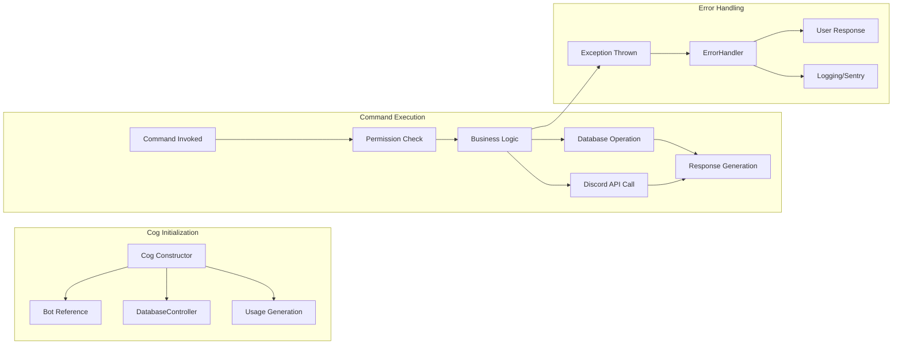
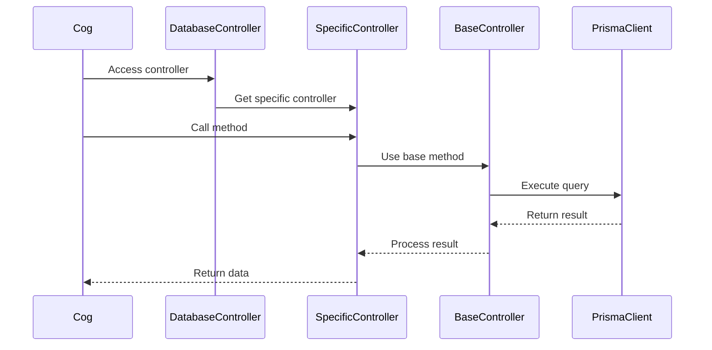

# Current Architecture and Patterns Analysis

## Overview

This document provides a comprehensive analysis of the current Tux Discord bot architecture, documenting existing patterns, dependencies, error handling approaches, and database usage patterns as identified in the codebase audit.

## 1. Existing Cog Structure and Dependencies

### 1.1 Cog Organization

The Tux bot follows a modular cog-based architecture organized into the following categories:

```
tux/cogs/
├── admin/          # Administrative commands (dev, eval, git, mail, mock)
├── fun/            # Entertainment commands (fact, imgeffect, rand, xkcd)
├── guild/          # Guild management (config, rolecount, setup)
├── info/           # Information commands (avatar, info, membercount)
├── levels/         # Leveling system (level, levels)
├── moderation/     # Moderation tools (ban, kick, timeout, cases, etc.)
├── services/       # Background services (levels, starboard, temp_vc, etc.)
├── snippets/       # Code snippet management
├── tools/          # Utility tools (tldr, wolfram)
└── utility/        # General utilities (ping, poll, remindme, etc.)
```

### 1.2 Cog Loading Architecture

**CogLoader System:**

- **Priority-based loading**: Cogs are loaded in priority order (services: 90, admin: 80, etc.)
- **Concurrent loading**: Cogs within the same priority group are loaded concurrently
- **Load order**: handlers → cogs → extensions
- **Performance monitoring**: Individual cog load times are tracked
- **Error handling**: Failed cog loads are logged with full context

**Loading Sequence:**

1. Handlers (highest priority - error handling, events)
2.lar cogs (priority-based concurrent loading)
3. Extensions (lowest priority)

### 1.3 Common Initialization Pattern

**Current Pattern (Repeated across 40+ cogs):**

```python
class SomeCog(commands.Cog):
    def __init__(self, bot: Tux) -> None:
        self.bot = bot
        self.db = DatabaseController()  # Direct instantiation
        # Command usage generation
        self.command_name.usage = generate_usage(self.command_name)
```

**Issues Identified:**

- **DRY Violation**: Same initialization pattern repeated in every cog
- **Tight Coupling**: Direct DatabaseController instantiation
- **No Dependency Injection**: Manual dependency management
- **Testing Difficulty**: Hard to mock dependencies

### 1.4 Dependency Relationships

**Core Dependencies:**



**Circular Dependencies Identified:**

- Some cogs import from each other (moderation base classes)
- Utils functions sometimes import from cogs
- Configuration dependencies spread across multiple modules

## 2. Current Error Handling Approaches

### 2.1 Centralized Error Handler

**ErrorHandler Cog Architecture:**

- **Unified handling**: Both prefix and slash command errors
- **Configuration-driven**: `ERROR_CONFIG_MAP` defines handling for each error type
- **Sentry integration**: Automatic error reporting with context
- **User-friendly messages**: Structured error responses

**Error Processing Flow:**

1. Error interception (prefix/slash commands)
2. Error unwrapping (nested exceptions)
3. Configuration lookup
4. Message formatting
5. Embed creation and sending
6. Logging and Sentry reporting

### 2.2 Error Configuration System

**ErrorHandlerConfig Structure:**

```python
@dataclass
class ErrorHandlerConfig:
    message_format: str                    # User-facing message
    detail_extractor: ErrorDetailExtractor # Extract specific details
    log_level: str = "INFO"               # Logging level
    send_to_sentry: bool = True           # Sentry reporting
```

**Coverage:**

- **Discord.py errors**: Permissions, not found, HTTP exceptions
- **Command errors**: Missing arguments, bad arguments, cooldowns
- **Custom errors**: Permission levels, code execution errors
- **Python built-ins**: ValueError, TypeError, KeyError, etc.

### 2.3 Error Handling Patterns in Cogs

**Inconsistent Approaches:**

1. **Try-catch with logging**: Some cogs handle errors locally
2. **Silent failures**: Some operations fail without user notification
3. **Mixed error responses**: Different embed styles and messages
4. **Incomplete error context**: Missing user/guild information

**Example Patterns Found:**

```python
# Pattern 1: Local error handling
try:
    result = await some_operation()
except Exception as e:
    logger.error(f"Operation failed: {e}")
    await ctx.send("Error occurred")

# Pattern 2: Centralized handling (preferred)
# Let ErrorHandler catch and process the exception
```

### 2.4 Sentry Integration

**Current Implementation:**

- **Transaction tracking**: Command execution tracking
- **Span creation**: Database operations, cog loading
- **Context enrichment**: User, guild, command information
- **Performance monitoring**: Load times, query performance

**Areas for Improvement:**

- Inconsistent span creation across modules
- Missing context in some error scenarios
- Performance data not fully utilized

## 3. Database Controller Usage Patterns

### 3.1 Database Architecture

**Three-Layer Structure:**

```
DatabaseController (Facade)
    ↓
Specific Controllers (CaseController, GuildController, etc.)
    ↓
BaseController (Generic CRUD operations)
    ↓
Prisma Client (ORM)
```

### 3.2 BaseController Pattern

**Strengths:**

- **Generic CRUD operations**: Standardized database interactions
- **Error handling**: Consistent error logging and Sentry reporting
- **Transaction support**: Built-in transaction management
- **Query building**: Helper methods for complex queries

**Key Methods:**

- `find_one()`, `find_many()`, `find_unique()`
- `create()`, `update()`, `delete()`, `upsert()`
- `update_many()`, `delete_many()`
- `execute_transaction()`

### 3.3 Controller Instantiation Patterns

**Current Pattern (Problematic):**

```python
# In every cog
self.db = DatabaseController()
```

**Issues:**

- **Multiple instances**: Each cog creates its own controller
- **No connection pooling**: Potential resource waste
- **Testing difficulty**: Hard to mock database interactions
- **Inconsistent lifecycle**: Controllers created/destroyed with cogs

### 3.4 Database Usage Analysis

**Common Patterns:**

1. **Direct controller access**: `self.db.case.create(...)`
2. **Transaction usage**: Limited use of transaction support
3. **Error handling**: Relies on BaseController error handling
4. **Query optimization**: Some controllers have optimized queries

**Specific Controller Usage:**

- **CaseController**: Heavy usage in moderation cogs
- **GuildConfigController**: Configuration management
- **LevelsController**: XP and leveling system
- **SnippetController**: Code snippet management

### 3.5 Database Connection Management

**Current Approach:**

- **Single client**: Shared Prisma client instance
- **Connection lifecycle**: Managed by TuxApp
- **Health checks**: Database connection validation
- **Graceful shutdown**: Proper connection cleanup

## 4. Visual System Architecture

### 4.1 High-Level Architecture Diagram



### 4.2 Cog Dependency Flow



### 4.3 Database Access Pattern



## 5. Key Architectural Patterns

### 5.1 Strengths

1. **Modular Design**: Clear separation of concerns by cog categories
2. **Centralized Error Handling**: Unified error processing and reporting
3. **Database Abstraction**: Clean separation between business logic and data access
4. **Performance Monitoring**: Comprehensive Sentry integration
5. **Async Architecture**: Proper async/await usage throughout

### 5.2 Areas for Improvement

1. **Dependency Injection**: Manual dependency management
2. **Code Duplication**: Repeated initialization patterns
3. **Testing Support**: Limited testability due to tight coupling
4. **Configuration Management**: Scattered configuration access
5. **Service Layer**: Business logic mixed with presentation logic

### 5.3 Architectural Debt

1. **Initialization Boilerplate**: 40+ cogs with identical setup
2. **Direct Database Access**: No service layer abstraction
3. **Mixed Concerns**: Cogs handling both Discord interactions and business logic
4. **Inconsistent Error Handling**: Some local error handling bypasses central system
5. **Resource Management**: Multiple database controller instances

## 6. Recommendations

### 6.1 Immediate Improvements

1. **Implement Dependency Injection**: Reduce boilerplate and improve testability
2. **Create Service Layer**: Separate business logic from presentation
3. **Standardize Error Handling**: Ensure all errors go through central handler
4. **Consolidate Database Access**: Single controller instance with proper lifecycle

### 6.2 Long-term Architectural Goals

1. **Clean Architecture**: Clear layer separation
2. **Improved Testing**: Better test coverage through dependency injection
3. **Performance Optimization**: Connection pooling and caching
4. **Monitoring Enhancement**: Better observability and metrics

This analysis provides the foundation for the improvement plan outlined in the design document, identifying specific areas where architectural patterns can be enhanced while preserving the system's strengths.
