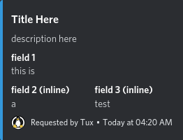

# embed standard
> generated with discohook

## Standard


#### Notes:
- color is `Colour.blue` from discord.py
- this is a webhook json payload for a standard embed, you can send this to a discord webhook to create an embed message if you don't want to use the discord.py library
- this is used for stuff such as info messages, help commands, etc that should just be informative

```json
{
  "content": null,
  "embeds": [
    {
      "title": "Title Here",
      "description": "description here",
      "color": 3447003,
      "fields": [
        {
          "name": "field 1",
          "value": "this is"
        },
        {
          "name": "field 2 (inline)",
          "value": "a",
          "inline": true
        },
        {
          "name": "field 3 (inline)",
          "value": "test",
          "inline": true
        }
      ],
      "footer": {
        "text": "Requested by Tux",
        "icon_url": "https://cdn.discordapp.com/avatars/1172803065779339304/510e1c7b910fa6cad73edceeaa8b17f7.png"
      },
      "timestamp": "1984-03-14T04:20:00.000Z"
    }
  ],
  "attachments": []
}
```

replace the color with different values to change the type of embed
i recommend sticking to the default discord.py colors for consistency


