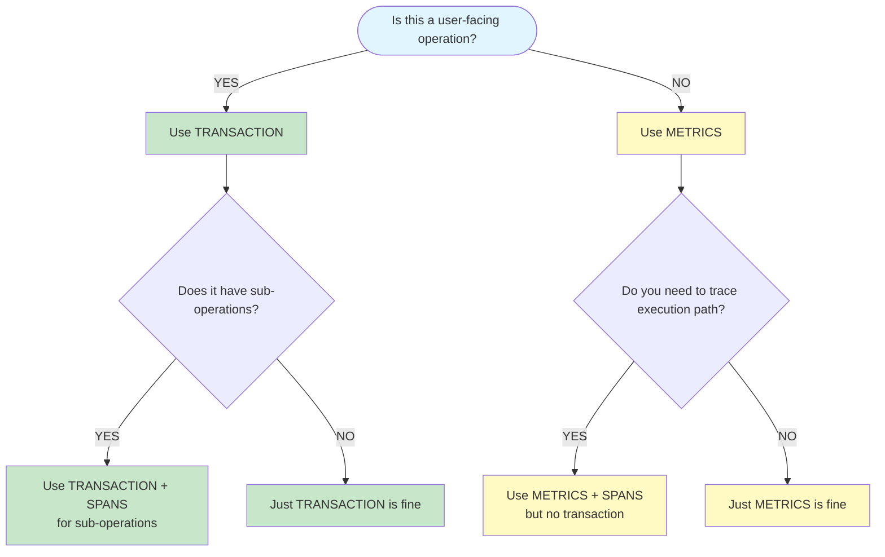

# Choosing Instrumentation - Decision Guide

This guide helps you decide when to use **transactions**, **spans**, or **metrics** for observability in Tux.

## Quick Decision Tree



## When to Use Transactions

**Transactions** represent **user-facing operations** with clear start/end boundaries.

✅ **Use transactions for:**

- **Command execution** (automatically done via `instrument_bot_commands()`)
- **API requests** (HTTP endpoints, webhooks)
- **User interactions** (button clicks, form submissions)
- **Background tasks triggered by users** (e.g., scheduled reports requested by a user)

❌ **Don't use transactions for:**

- Setup/initialization code
- Background maintenance tasks
- Internal operations
- Long-running processes without clear user context

**Example:**

```python
# ✅ GOOD: Command execution is a transaction
@commands.command()
async def ping(ctx):
    # This is automatically wrapped in a transaction
    await ctx.send("Pong!")

# ❌ BAD: Setup is not a transaction
@transaction("cog.setup", name="CogLoader Setup")  # WRONG!
async def setup(cls, bot):
    # Errors in cog initialization will be incorrectly attributed here
    await load_cogs()
```

## When to Use Spans

**Spans** represent **operations within a transaction**. They show the breakdown of work inside a user-facing operation.

✅ **Use spans for:**

- **Operations within a command** (database queries, API calls, file operations)
- **Steps in a transaction** (validate input → fetch data → process → save)
- **Nested operations** that you want to see in the trace view

❌ **Don't use spans for:**

- Standalone operations (use metrics instead)
- Operations outside a transaction context
- Very frequent operations (use metrics for aggregation)

**Example:**

```python
@commands.command()  # Automatically a transaction
async def get_user(ctx, user_id: int):
    # ✅ GOOD: Span for database query within the transaction
    with start_span("db.query", name="Fetch user"):
        user = await db.get_user(user_id)
    
    # ✅ GOOD: Span for API call within the transaction
    with start_span("api.call", name="Fetch user avatar"):
        avatar = await fetch_avatar(user.id)
    
    await ctx.send(f"User: {user.name}")
```

## When to Use Metrics

**Metrics** are for **aggregating data points** - counts, distributions, and gauges. They're perfect for background operations, setup, and performance monitoring.

✅ **Use metrics for:**

- **Setup/initialization operations** (cog loading, database migrations)
- **Background tasks** (periodic cleanup, cache updates)
- **Performance monitoring** (operation durations, success rates)
- **Usage statistics** (command usage, feature adoption)
- **System health** (cache sizes, connection pool usage)

❌ **Don't use metrics for:**

- User-facing operations (use transactions)
- Operations you need to trace step-by-step (use spans)
- One-off operations where you need full context

**Example:**

```python
# ✅ GOOD: Setup uses metrics
async def setup(cls, bot):
    start_time = time.perf_counter()
    try:
        await load_cogs()
        duration_ms = (time.perf_counter() - start_time) * 1000
        
        record_cog_metric(
            cog_name="CogLoader",
            operation="setup",
            duration_ms=duration_ms,
            success=True,
        )
    except Exception as e:
        duration_ms = (time.perf_counter() - start_time) * 1000
        record_cog_metric(
            cog_name="CogLoader",
            operation="setup",
            duration_ms=duration_ms,
            success=False,
            error_type=type(e).__name__,
        )
        capture_exception_safe(e)
        raise
```

## The Problem We Fixed

Previously, `CogLoader.setup()` was wrapped in a transaction, which meant **any error during cog initialization** (like a TypeError in the levels cog) was incorrectly attributed to "CogLoader Setup" in Sentry. This made debugging impossible because the error had nothing to do with the cog loader itself.

**Solution:** Use metrics for setup operations, not transactions. Errors are now correctly attributed to their actual source.

## Common Patterns

### Pattern 1: Command with Database Query

```python
@commands.command()  # Automatically a transaction
async def get_user(ctx, user_id: int):
    # Span for database operation
    with start_span("db.query", name="Fetch user"):
        user = await db.get_user(user_id)
    
    # Metrics for usage tracking
    record_command_metric(
        command_name="get_user",
        execution_time_ms=...,
        success=True,
    )
    
    await ctx.send(f"User: {user.name}")
```

### Pattern 2: Background Task

```python
async def daily_cleanup():
    start_time = time.perf_counter()
    try:
        await cleanup_old_records()
        duration_ms = (time.perf_counter() - start_time) * 1000
        
        # Metrics for background task
        record_task_metric(
            task_name="daily_cleanup",
            duration_ms=duration_ms,
            success=True,
            task_type="scheduled",
        )
    except Exception as e:
        duration_ms = (time.perf_counter() - start_time) * 1000
        record_task_metric(
            task_name="daily_cleanup",
            duration_ms=duration_ms,
            success=False,
            error_type=type(e).__name__,
        )
        capture_exception_safe(e)
        raise
```

### Pattern 3: Setup Operation

```python
async def setup():
    start_time = time.perf_counter()
    try:
        await initialize_services()
        duration_ms = (time.perf_counter() - start_time) * 1000
        
        # Metrics for setup
        record_cog_metric(
            cog_name="MyService",
            operation="setup",
            duration_ms=duration_ms,
            success=True,
        )
    except Exception as e:
        duration_ms = (time.perf_counter() - start_time) * 1000
        record_cog_metric(
            cog_name="MyService",
            operation="setup",
            duration_ms=duration_ms,
            success=False,
            error_type=type(e).__name__,
        )
        capture_exception_safe(e, extra_context={"operation": "setup"})
        raise
```

## Key Takeaways

1. **Transactions = User-facing operations** (commands, API requests)
2. **Spans = Operations within transactions** (breakdown of work)
3. **Metrics = Aggregated data points** (setup, background tasks, statistics)
4. **Never use transactions for setup/initialization** - errors will be misattributed
5. **Always capture exceptions separately** when using metrics (not in a transaction)

## Related Documentation

- [Transactions and Spans](./transactions-spans.md) - How to implement transactions and spans
- [Metrics](./metrics.md) - How to implement metrics
- [Context and Data](./context-data.md) - How to add tags, context, and span data
