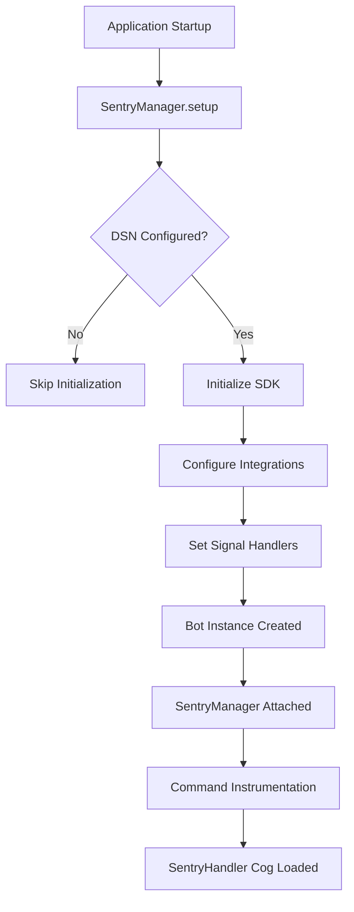

# Sentry Integration

!!! warning "Work in progress"
    This section is a work in progress. Please help us by contributing to the documentation.

Tux integrates with Sentry for comprehensive error tracking, performance monitoring, and production observability. The Sentry integration provides automatic exception capture, command performance tracking, distributed tracing, and rich contextual data for debugging production issues.

## Overview

The Sentry integration consists of several components working together:

- **SentryManager** - Centralized interface for all Sentry operations
- **Configuration** - DSN setup, environment detection, and SDK initialization
- **Context Management** - User, command, and custom context enrichment
- **Tracing** - Performance monitoring with transactions and spans
- **Metrics** - Performance metrics collection and aggregation
- **Event Handlers** - Filtering and processing before sending to Sentry
- **Specialized Utilities** - Domain-specific error capture functions

## Architecture

### Scope and Client Pattern

The Sentry SDK uses a **Scope and Client** pattern for managing state and context:

**Scope:**

- Holds contextual data (tags, extra data, user info, breadcrumbs)
- Thread-local storage for isolation
- Contains a reference to the Client
- Manages event data before sending

**Client:**

- Handles event processing and serialization
- Manages transport and delivery to Sentry servers
- Applies sampling and filtering
- Single instance per application

In Tux, we interact with scopes through `SentryManager` and specialized capture functions. The SDK automatically manages the client instance.

### Component Structure

```text
src/tux/services/sentry/
├── __init__.py          # SentryManager class and public API
├── config.py            # SDK initialization and configuration
├── context.py           # Context enrichment (users, commands)
├── tracing.py           # Performance monitoring decorators
├── metrics.py           # Performance metrics collection
├── handlers.py          # Event filtering and sampling
├── utils.py             # Specialized error capture functions
└── cog.py               # Discord event listeners for tracking
```

### Data Flow

Understanding how events flow through the Sentry SDK helps you use it effectively:

**Event Capture Flow:**

1. **Exception occurs** or **manual capture** called (e.g., `capture_exception()`)
2. **Current scope** retrieved (contains tags, user, context, breadcrumbs)
3. **Isolation scope** checked for operation-specific context
4. **Scope data** attached to event (tags, user info, context, breadcrumbs)
5. **Client.process_event()** processes the event
6. **Sampling** and **filtering** applied (`before_send` handler)
7. **Transport** sends event to Sentry servers (HTTP transport with retries)

**Performance Monitoring Flow:**

1. **Transaction started** with `start_transaction()` or automatic instrumentation
2. **Spans** created for operations within transaction with `start_span()`
3. **Timing data** collected automatically
4. **Transaction finished** and processed
5. **Sampling** applied (`traces_sampler` function)
6. **Transport** sends transaction to Sentry

### Integration Architecture

Sentry uses an **integrations system** to automatically instrument frameworks and libraries:

**Integration Lifecycle:**

1. **Registration**: Integration registered during `init()` (e.g., `AsyncioIntegration()`, `LoguruIntegration()`)
2. **Setup**: `setup_once()` called to install hooks and patches
3. **Runtime**: Integration monitors and captures events automatically
4. **Teardown**: Integration cleaned up on shutdown

**Common Integration Patterns:**

- **Monkey patching**: Replace functions/methods with instrumented versions
- **Signal handlers**: Hook into framework signals/events
- **Middleware**: Add middleware to web frameworks
- **Exception handlers**: Catch and process exceptions

**Tux Integrations:**

- **AsyncioIntegration**: Captures asyncio task exceptions and performance
- **LoguruIntegration**: Converts Loguru logs to Sentry breadcrumbs and events

### Transport Layer

The **transport layer** handles event delivery to Sentry servers:

- **HttpTransport**: HTTP transport to Sentry ingestion endpoints
- **Retry logic**: Automatic retries for transient failures
- **Rate limiting**: Respects Sentry rate limits
- **Queuing**: Queues events when offline or rate-limited
- **Batching**: Efficiently batches multiple events

You don't need to interact with the transport directly—it's managed automatically by the SDK.

### Initialization Flow



**Initialization Sequence:**

1. **Application Layer** - `SentryManager.setup()` called first in `TuxApp.start()`
2. **Configuration Check** - Validates `SENTRY_DSN` environment variable
3. **SDK Initialization** - Configures Sentry with integrations and handlers
4. **Integration Setup** - Integrations install hooks and patches
5. **Bot Attachment** - `SentryManager` instance attached to bot
6. **Core Setup Hook** - `setup_hook()` triggered during `bot.login()`
7. **Command Instrumentation** - Automatic tracing for all commands
8. **Event Listeners** - `SentryHandler` cog tracks command execution

## Configuration

### Environment Setup

Sentry requires a DSN (Data Source Name) from your Sentry project:

```bash
# Required: Sentry DSN from your project settings
SENTRY_DSN=https://your-key@your-org.ingest.sentry.io/project-id
```

**Getting Your DSN:**

1. Create a project at [sentry.io](https://sentry.io)
2. Navigate to **Settings → Projects → Your Project → Client Keys (DSN)**
3. Copy the DSN and add it to your `.env` file

### SDK Configuration

Tux configures Sentry with production-ready defaults that work out of the box. The SDK automatically detects your environment (development or production) and tags all events with your bot version for release tracking.

**Key Features:**

- **Release Tracking** - Events automatically tagged with bot version for tracking issues across releases
- **Environment Detection** - Development and production events separated automatically
- **Log Integration** - Loguru logs become breadcrumbs providing context around errors
- **Performance Monitoring** - Tracing enabled for commands and operations to identify slow code paths
- **Privacy Protection** - No personally identifiable information sent by default

You don't need to configure these options yourself—they're set automatically when Sentry initializes. If you need custom configuration, modify `src/tux/services/sentry/config.py`.

### Graceful Shutdown

Sentry automatically handles shutdown gracefully. When you stop the bot (via SIGTERM or SIGINT), Sentry reports the shutdown signal and flushes any pending events before the bot exits. This ensures you don't lose error reports during shutdown.

The flush operation has a 10-second timeout, and if it fails, the bot continues shutting down normally. You don't need to do anything special—this happens automatically.

## Using Sentry in Your Code

### Capturing Exceptions

When errors occur, you can capture them with context to help debug issues later. The `SentryManager` provides methods for capturing exceptions and messages.

Access Sentry through the bot instance:

```python
sentry = self.bot.sentry_manager
```

**Basic Exception Capture:**

Capture exceptions with `capture_exception()`. For better debugging, include context like the user, command, or custom tags:

```python
try:
    await perform_operation()
except Exception as e:
    self.bot.sentry_manager.capture_exception(
        e,
        user=ctx.author,
        command_context=ctx,
        tags={"error_type": "database"},
        level="error"
    )
```

**Capturing Messages:**

You can also capture informational messages or warnings:

```python
self.bot.sentry_manager.capture_message("Rate limit approaching", level="warning")
```

### Adding Context

Context helps you understand what was happening when an error occurred. Set user context, command context, or custom tags to enrich error reports.

**User and Command Context:**

The `SentryHandler` cog automatically sets user and command context for all commands. If you need to set context manually:

```python
from tux.services.sentry import set_user_context, set_command_context

set_user_context(ctx.author)
set_command_context(ctx)
```

**Custom Tags and Context:**

Add custom tags for filtering and grouping errors in Sentry:

```python
sentry = self.bot.sentry_manager
sentry.set_tag("feature", "moderation")
sentry.set_tag("guild_id", str(guild.id))
sentry.set_context("custom", {"operation": "bulk_update", "record_count": 100})
```

For detailed information about scopes, tags, context, and breadcrumbs, see [Context and Data](./context-data.md).

### Performance Monitoring

Sentry automatically tracks command performance, but you can add custom transactions and spans for important operations.

**Transactions** track complete operations from start to finish. Use them for background tasks or major operations:

```python
from tux.services.sentry import start_transaction

with start_transaction(op="task.background", name="process_daily_report") as txn:
    await collect_statistics()
    await send_report()
```

**Spans** track individual operations within a transaction. Use them to see which parts of your code are slow:

```python
from tux.services.sentry import start_span

with start_span(op="database.query", name="Fetch user data") as span:
    user = await db.get_user(user_id)
```

You can also use decorators to automatically wrap functions with transactions or spans—see the tracing decorators section below.

For detailed information about metrics, see [Metrics](./metrics.md).

### Metrics

Sentry metrics track performance and usage patterns throughout Tux. Metrics are automatically recorded for commands, database operations, API calls, and more.

**Available Metric Types:**

- **Counters** - Track event occurrences (command usage, errors, cache hits/misses)
- **Distributions** - Track measurements with percentiles (execution times, latencies)
- **Gauges** - Track current values (cache sizes, connection pool usage)

**Automatic Metrics:**

- Command execution time and usage
- Database query performance
- API request latencies
- Cache hit/miss rates
- Background task execution

**Manual Metrics:**

You can record custom metrics for specific operations:

```python
from tux.services.sentry import record_api_metric

record_api_metric(
    endpoint="repos.get",
    duration_ms=150,
    success=True,
)
```

For complete metrics documentation, see [Metrics](./metrics.md).

## Automatic Context Tracking

The `SentryHandler` cog automatically enriches error reports with context, so you don't need to manually set context for most cases.

### User Context

**Tux tracks users via Discord user IDs!** When a command runs, Sentry automatically captures Discord user information including:

- **User ID** - Discord user ID (used as unique identifier in Sentry)
- **Username & Display Name** - For better identification
- **Bot & System Flags** - Whether the user is a bot or system user
- **Guild Information** - Guild ID, name, member count (if member)
- **Permissions & Roles** - User's permissions and top role (if member)
- **Join Timestamp** - When user joined guild (if member)

This enables powerful user-based analytics in Sentry:

- Filter errors by specific Discord users
- See user impact analysis (how many users affected)
- Track error rates per user
- Group errors by user to identify problematic users

All commands (prefix and slash) automatically include user context.

### Command Context

Command context captures execution details automatically. For prefix commands, it includes the command name, message ID, channel and guild information, arguments, and the prefix used. For slash commands, it includes interaction details and options.

### Performance Tracking

Command execution time is tracked automatically. The `SentryHandler` cog records when commands start and finish, measuring execution duration and tracking success or failure. This data helps you identify slow commands and understand performance patterns.

You don't need to manually track command performance—it happens automatically for all commands.

## Tracing Decorators

Use decorators to automatically track function performance and errors. Decorators handle timing, error capture, and status tracking for you.

### Transaction Decorator

Wrap entire functions with `@transaction` to track complete operations. The decorator automatically measures execution time, captures errors with stack traces, and tracks success or failure status:

```python
from tux.services.sentry import transaction

@transaction(op="task.background", name="daily_cleanup")
async def perform_daily_cleanup():
    await cleanup_old_records()
```

### Span Decorator

Use `@span` to track operations within existing transactions. Spans appear nested within parent transactions, helping you see which parts of your code are slow:

```python
from tux.services.sentry import span

@span(op="database.query", description="Fetch user by ID")
async def get_user(user_id: int):
    return await db.get_user(user_id)
```

### Context Managers

For fine-grained control, use context managers directly. This gives you access to the transaction or span object to set tags and data:

```python
from tux.services.sentry import start_transaction, start_span

with start_transaction(op="api.request", name="fetch_data") as txn:
    txn.set_tag("endpoint", "/api/users")
    
    with start_span(op="http.request", name="GET /api/users") as span:
        response = await httpx.get("/api/users")
        span.set_data("status_code", response.status_code)
```

## Specialized Error Capture

Tux provides specialized error capture functions that automatically add relevant context based on the error type. Use these instead of generic `capture_exception()` for better error reports.

### Database Errors

Use `capture_database_error()` when database operations fail. It automatically includes query details, table name, and operation type:

```python
from tux.services.sentry import capture_database_error

try:
    await db.execute_query(query)
except Exception as e:
    capture_database_error(e, query=query, table="users", operation="select")
```

### API Errors

For HTTPX errors in API wrappers, use `convert_httpx_error()` to automatically convert HTTPX exceptions to TuxAPI exceptions and report them to Sentry:

```python
from tux.services.sentry import convert_httpx_error

try:
    response = await httpx.get(endpoint)
except Exception as e:
    convert_httpx_error(
        e,
        service_name="GitHub",
        endpoint="repos.get",
        not_found_resource=f"{owner}/{repo}",  # Optional: for 404 errors
    )
```

This function automatically:

- Converts 404 errors to `TuxAPIResourceNotFoundError`
- Converts 403 errors to `TuxAPIPermissionError`
- Converts other HTTP status errors to `TuxAPIRequestError`
- Converts connection errors to `TuxAPIConnectionError`
- Reports all errors to Sentry with appropriate context via `capture_api_error()`

For other HTTP error scenarios where you need more control, use `capture_api_error()` directly:

```python
from tux.services.sentry import capture_api_error

try:
    response = await httpx.get(endpoint)
except Exception as e:
    capture_api_error(e, endpoint=endpoint, status_code=response.status_code)
```

### Cog Errors

Use `capture_cog_error()` for errors within cogs. It automatically tags errors with cog and command names:

```python
from tux.services.sentry import capture_cog_error

try:
    await self.bot.process_commands(message)
except Exception as e:
    capture_cog_error(e, cog_name=self.__class__.__name__, command_name=ctx.command.name)
```

### Tux Errors

Use `capture_tux_exception()` for Tux-specific errors. It includes error severity and user-facing flags:

```python
from tux.services.sentry import capture_tux_exception

try:
    await perform_operation()
except TuxError as e:
    capture_tux_exception(e, command_name="moderation.ban", user_id=str(ctx.author.id))
```

### Safe Exception Capture

Use `capture_exception_safe()` when you want to include local variables from the calling function. This is useful for debugging complex issues:

```python
from tux.services.sentry import capture_exception_safe

capture_exception_safe(error, extra_context={"operation": "user_update"}, capture_locals=True)
```

## Event Filtering and Sampling

Sentry automatically filters noisy events and samples performance data to keep your error reports focused and your Sentry quota manageable.

### Logger Filtering

Noisy loggers from Discord and HTTP libraries are automatically excluded. This includes WebSocket connection logs, HTTP request logs, and event loop logs that aren't actionable. Only application errors are sent to Sentry, keeping your dashboard focused on real issues.

### Transaction Sampling

Performance monitoring uses intelligent sampling to reduce overhead. Different operation types have different sampling rates:

- **Commands** - 10% sampled (high value, moderate volume)
- **Database/HTTP** - 5% sampled (frequent operations)
- **Background Tasks** - 2% sampled (periodic operations)
- **Other** - 1% sampled (catch-all for low-volume operations)

This means you get representative performance data without overwhelming Sentry with every single operation. Sampling rates are configured in `src/tux/services/sentry/handlers.py` if you need to adjust them.

### Span Filtering

Redundant spans are automatically grouped and filtered. Discord API spans are excluded (too noisy), and similar spans are combined into summary spans to reduce clutter in performance traces.

## How Sentry Integrates with Tux

Sentry integrates seamlessly throughout Tux's lifecycle. You don't need to do anything special—it works automatically.

### Bot Integration

When the bot initializes, a `SentryManager` instance is created and attached to the bot. After cogs load, commands are automatically instrumented with performance tracing. Global exception handlers capture errors, and during shutdown, pending events are flushed automatically.

Access Sentry through `self.bot.sentry_manager` in your cogs.

### Cog Integration

The `SentryHandler` cog automatically tracks all commands. It sets user and command context, tracks execution start and end times, and records success or failure status. This happens automatically—you don't need to add any tracking code to your commands.

### Application Integration

Sentry initializes first during application startup, before any other services. This ensures startup errors are captured. Signal handlers are registered for graceful shutdown, and events are flushed before the bot exits.

You don't need to manage any of this—it's all handled automatically by Tux's application layer.

## Best Practices

### Error Capture

Use specialized capture functions instead of generic `capture_exception()`. Functions like `capture_database_error()` and `capture_api_error()` automatically add relevant context, making errors easier to debug.

Always enrich errors with context. Include the user, command context, and relevant tags. This helps you understand what was happening when the error occurred.

The `SentryHandler` cog sets user and command context automatically for commands. When capturing errors manually, add domain-specific context to help with debugging.

### Performance Monitoring Best Practices

Use transactions for major operations like background tasks or complex workflows. Use spans for nested operations within transactions to see which parts of your code are slow. Commands are automatically tracked, but you should add custom transactions and spans for important operations outside of commands.

Use metrics for high-volume operations where you need aggregated statistics. Metrics are more efficient than transactions for tracking counts, latencies, and gauges at scale. See [Metrics](./metrics.md) for detailed information.

### Context Management

Set context early, ideally at the start of operations. If you set context after an error occurs, you'll miss valuable debugging information. The `SentryHandler` cog handles this automatically for commands, but for custom operations, set context before doing work.

Use scoped context for operations that shouldn't affect subsequent events. Push a new scope, set tags and context, perform the operation, then pop the scope. This prevents context from leaking into unrelated operations.

### Privacy & Security

Never include personally identifiable information in tags or context. Use IDs instead of names, and never send passwords, API keys, or other sensitive data. Sentry is configured to not send PII by default, but be careful when adding custom context.

Filter sensitive data before capturing errors. If you need to include local variables for debugging, sanitize them first to remove passwords, tokens, or other secrets.

## Troubleshooting

### Sentry Not Initializing

**Symptoms:**

- No events appearing in Sentry dashboard
- `is_initialized` returns `False`

**Solutions:**

1. **Check DSN Configuration:**

   ```bash
   # Verify environment variable
   echo $SENTRY_DSN
   
   # Check .env file
   grep SENTRY_DSN .env
   ```

2. **Verify DSN Format:**

   ```bash
   # Should start with https://
   SENTRY_DSN=https://key@org.ingest.sentry.io/project-id
   ```

3. **Check Logs:**

   ```bash
   # Look for initialization messages
   grep -i sentry logs/tux.log
   ```

### Events Not Appearing

**Symptoms:**

- Errors occur but don't show in Sentry
- Events filtered or dropped

**Solutions:**

1. **Check Event Filtering:**

   ```python
   # Verify logger isn't excluded
   # Check handlers.py excluded_loggers list
   ```

2. **Verify Sampling:**

   ```python
   # Low-volume operations may be sampled out
   # Check traces_sampler configuration
   ```

3. **Check Flush:**

   ```python
   # Ensure events are flushed
   await SentryManager.flush_async()
   ```

### Performance Impact

**Symptoms:**

- Bot latency increases with Sentry enabled
- High CPU usage

**Solutions:**

1. **Adjust Sampling Rates:**

   ```python
   # Reduce sampling for high-volume operations
   if op == "database.query":
       return 0.01  # 1% instead of 5%
   ```

2. **Filter Noisy Operations:**

   ```python
   # Exclude frequent, low-value operations
   excluded_ops = ["cache.get", "cache.set"]
   ```

3. **Use Async Flush:**

   ```python
   # Don't block on flush
   await SentryManager.flush_async(timeout=5.0)
   ```

## Related Documentation

- [Choosing Instrumentation](./choosing-instrumentation.md) - When to use transactions/spans vs metrics
- [Transactions and Spans](./transactions-spans.md) - How to use transactions and spans
- [Metrics](./metrics.md) - Performance metrics
- [Context and Data](./context-data.md) - Tags, context, scopes, users, breadcrumbs
- [Sampling](./sampling.md) - Error and transaction sampling configuration

## Resources

- **Source Code**: `src/tux/services/sentry/`
- **Sentry SDK Docs**: <https://docs.sentry.io/platforms/python/>
- **Configuration**: See `config.py` for initialization options
- **Bot Integration**: See `../../concepts/core/bot.md` for lifecycle integration
- **Application Integration**: See `../../concepts/core/app.md` for startup integration
