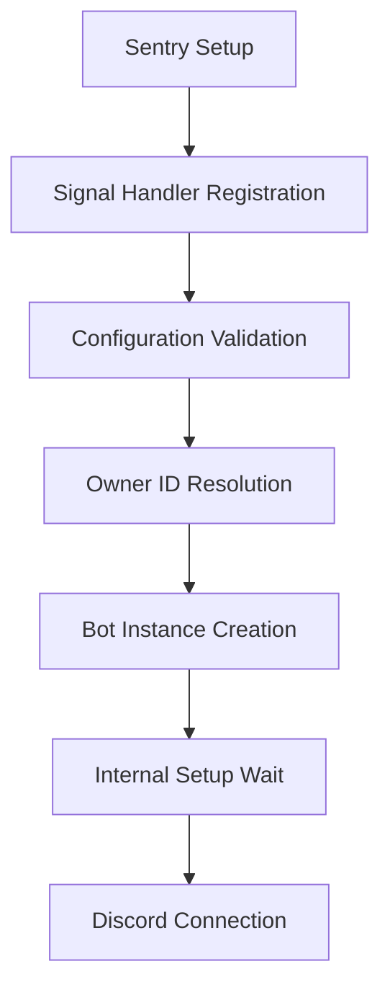

# Application Layer

!!! wip "Work in progress"
    This section is a work in progress. Please help us by contributing to the documentation.

The application layer (`src/tux/core/app.py`) orchestrates Tux's complete lifecycle from startup to shutdown. It handles initialization, signal handling, configuration validation, and graceful error recovery.

## Overview

The application layer manages two main responsibilities:

- **Command Prefix Resolution** - Dynamic prefix system with per-guild customization and caching
- **Bot Lifecycle Management** - Complete startup and shutdown orchestration through the `TuxApp` class

## Command Prefix Resolution

Tux uses a priority-based prefix resolution system that supports per-guild customization while maintaining fast performance through caching.

### How Prefix Resolution Works

When a message arrives, Tux checks prefixes in this order:

1. **Environment Override** - If `BOT_INFO__PREFIX` is set, all guilds use that prefix
2. **DM Channels** - Direct messages always use the default prefix (no guild context)
3. **Guild Cache** - Fast in-memory lookup for guild-specific prefixes
4. **Default Fallback** - Configuration default if cache is unavailable

The prefix manager caches guild prefixes in memory for sub-millisecond lookups. If the database is unavailable, it gracefully falls back to the default prefix, so commands still work.

### Performance Features

- **In-memory caching** via `PrefixManager` for fast lookups
- **Lazy initialization** - prefix manager loads after bot setup
- **Graceful degradation** - falls back to defaults if database unavailable

## Bot Lifecycle Management

The `TuxApp` class manages the complete bot lifecycle with structured phases and comprehensive error handling.

### Startup Sequence

The bot startup follows a carefully orchestrated sequence:



**Startup Steps:**

1. **Sentry Initialization** - Error tracking set up first to capture any startup failures
2. **Signal Handler Registration** - SIGTERM/SIGINT handlers registered for graceful shutdown
3. **Configuration Validation** - Bot token and critical settings verified before proceeding
4. **Owner ID Resolution** - Bot owner and optional sysadmin IDs determined
5. **Bot Instance Creation** - Tux bot instance created with proper configuration
6. **Internal Setup Wait** - Waits for database, cogs, and caches to initialize
7. **Discord Connection** - Establishes WebSocket connection to Discord gateway

### Signal Handling

Tux handles shutdown signals gracefully, with different behavior based on when the signal is received.

**During Setup:**

- Traditional signal handlers work with synchronous operations
- SIGINT causes immediate exit (useful for interrupting migrations)
- SIGTERM initiates graceful shutdown

**After Connection:**

- Asyncio signal handlers provide better integration
- Both SIGINT and SIGTERM trigger graceful shutdown
- Tasks are cancelled and resources cleaned up properly

**Cross-Platform Support:**

- Unix/Linux/macOS use event loop signal handlers for immediate response
- Windows uses traditional signal module with KeyboardInterrupt raising

### Error Handling

The application layer provides comprehensive error handling with appropriate exit codes:

- **Exit Code 0** - Normal completion (rare, usually exits via signal)
- **Exit Code 1** - Startup failure due to error
- **Exit Code 130** - User-requested shutdown (SIGINT/Ctrl+C or SIGTERM)

All errors are captured by Sentry with context, and startup failures include helpful error messages guiding you to fix configuration issues.

### Shutdown Sequence

When shutting down, Tux performs cleanup in this order:

1. **Bot Shutdown** - Closes Discord connection, stops background tasks, closes database connections
2. **Sentry Flush** - Sends any pending error reports (10-second timeout)
3. **Exit Code Determination** - Returns appropriate exit code based on shutdown type

Shutdown always completes cleanup, even if errors occur during the process.

## Configuration Integration

The application layer integrates deeply with Tux's configuration system, reading from multiple sources:

- **Environment Variables** - `.env` file for secrets and overrides
- **TOML/YAML/JSON files** - Static configuration files
- **Database** - Guild-specific settings (prefixes, permissions)
- **Runtime Flags** - CLI arguments and dynamic settings

Configuration is validated before creating expensive resources, preventing wasted startup time when configuration is invalid.

## Using the Application Layer

### Starting the Bot

Start the bot using the CLI command:

```bash
# Standard startup
uv run tux start

# With debug logging
uv run tux start --debug

# Check configuration first
uv run tux config check
```

The application layer handles all lifecycle management automatically. You don't need to interact with `TuxApp` directly unless you're embedding Tux in another application.

### Exit Codes

The application returns exit codes you can use in scripts and systemd services:

- **0** - Normal completion
- **1** - Startup error (check logs and configuration)
- **130** - User-requested shutdown (normal for Ctrl+C)

Use exit codes in deployment scripts to detect startup failures:

```bash
uv run tux start
if [ $? -eq 1 ]; then
    echo "Bot failed to start - check logs"
    exit 1
fi
```

## Troubleshooting

### Startup Failures

**No Bot Token:**

If you see "No bot token provided", set `BOT_TOKEN` in your `.env` file. The application validates the token before attempting Discord connection.

**Database Connection Failed:**

Check your database configuration:

```bash
# Check database connectivity
uv run tux db health

# Verify environment variables
env | grep -E "(POSTGRES|DATABASE)"
```

**Cog Loading Failed:**

If cogs fail to load, check:

1. Cog files for syntax errors
2. Missing dependencies
3. Configuration requirements

Enable debug logging to see detailed error messages:

```bash
LOG_LEVEL=DEBUG uv run tux start
```

### Shutdown Issues

**Force Shutdown:**

If the bot doesn't shut down gracefully:

```bash
# Send SIGTERM (graceful)
kill -TERM $(pgrep -f "uv run tux")

# Send SIGKILL (force) if needed
kill -KILL $(pgrep -f "uv run tux")
```

**Hanging Processes:**

Check for hanging processes:

```bash
ps aux | grep tux
```

## Best Practices

### Configuration First

Validate configuration before creating expensive resources. This prevents wasted startup time and provides clear error messages when configuration is invalid.

### Graceful Shutdown

Always support SIGTERM/SIGINT for container orchestration. Tux handles these signals automatically, but ensure your custom code also handles shutdown gracefully.

### Error Recovery

Use structured exceptions and include context in error reports. The application layer captures errors automatically, but adding context helps debugging.

### Resource Cleanup

Always clean up resources during shutdown. The application layer handles bot resources, but clean up any custom resources you create.

## Resources

- **Source Code**: `src/tux/core/app.py`
- **Bot Class**: See `bot.md` for Discord integration details
- **Configuration**: See configuration documentation for setup
- **Sentry Integration**: See `../../best-practices/sentry/index.md` for error tracking details
