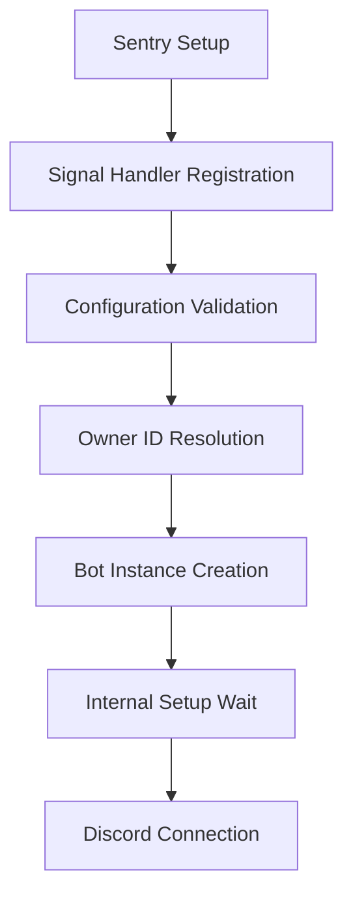

The application layer (`src/tux/core/app.py`) serves as Tux's main orchestrator, managing the complete bot lifecycle from startup to shutdown. It provides structured initialization, signal handling, configuration validation, and graceful error recovery with comprehensive Sentry integration.

## Overview

The application layer consists of two main components:

- **`get_prefix()`** - Dynamic command prefix resolution with caching
- **`TuxApp`** - Bot lifecycle management and orchestration class

## Command Prefix Resolution

### Dynamic Prefix System

Tux uses a sophisticated prefix resolution system that supports per-guild customization while maintaining performance through intelligent caching:

```python
async def get_prefix(bot: Tux, message: discord.Message) -> list[str]:
    """Resolve command prefix with priority-based fallback."""
    # Priority 1: Environment override (BOT_INFO__PREFIX)
    if CONFIG.is_prefix_override_enabled():
        return [CONFIG.get_prefix()]

    # Priority 2: DM channels use default prefix
    if not message.guild:
        return [CONFIG.get_prefix()]

    # Priority 3: Guild-specific prefix from cache
    if hasattr(bot, "prefix_manager") and bot.prefix_manager:
        prefix = await bot.prefix_manager.get_prefix(message.guild.id)
        return [prefix]

    # Priority 4: Fallback to default
    return [CONFIG.get_prefix()]
```

**Prefix Resolution Priority:**

1. **Environment Override** - `BOT_INFO__PREFIX` forces all guilds to use one prefix
2. **DM Channels** - Always use default prefix (no guild context available)
3. **Guild Cache** - Fast in-memory lookup for guild-specific prefixes
4. **Default Fallback** - Configuration default if cache unavailable

### Performance Considerations

- **In-memory caching** via `PrefixManager` for sub-millisecond lookups
- **Lazy initialization** - prefix manager loads after bot setup
- **Graceful degradation** - falls back to defaults if database unavailable

## TuxApp Class

### Lifecycle Management

The `TuxApp` class orchestrates the complete bot lifecycle with structured phases:

```python
class TuxApp:
    """Application wrapper for managing Tux bot lifecycle."""

    def __init__(self) -> None:
        """Initialize application state (bot not created yet)."""
        self.bot = None
        self._connect_task = None
        self._shutdown_event = None

    def run(self) -> None:
        """Synchronous entrypoint - creates event loop and runs bot."""

    async def start(self) -> None:
        """Async startup with full lifecycle orchestration."""
```

### Startup Sequence

The bot startup follows a carefully orchestrated sequence:



#### 1. Sentry Initialization

```python
# Initialize error tracking before anything else
SentryManager.setup()
```

**Why First:** Error tracking must be ready to capture any startup failures.

#### 2. Signal Handler Registration

```python
# Register SIGTERM/SIGINT handlers for graceful shutdown
loop = asyncio.get_running_loop()
self.setup_signals(loop)
```

**Cross-Platform Handling:**

- **Unix/Linux/macOS:** Event loop signal handlers for immediate response
- **Windows:** Traditional signal module with KeyboardInterrupt raising

#### 3. Configuration Validation

```python
# Critical validation - can't start without token
if not CONFIG.BOT_TOKEN:
    logger.critical("No bot token provided. Set BOT_TOKEN in your .env file.")
    sys.exit(1)
```

**Validation Points:**

- Bot token presence
- Owner ID configuration
- Database connectivity (validated during bot setup)

#### 4. Owner Permission Resolution

```python
def _resolve_owner_ids(self) -> set[int]:
    """Resolve owner IDs based on configuration and eval permissions."""
    owner_ids = {CONFIG.USER_IDS.BOT_OWNER_ID}

    # Optional: Grant sysadmins eval access
    if CONFIG.ALLOW_SYSADMINS_EVAL:
        logger.warning("⚠️ Eval enabled for sysadmins - potentially dangerous")
        owner_ids.update(CONFIG.USER_IDS.SYSADMINS)
```

**Permission Levels:**

- **Bot Owner** - Always has full permissions
- **Sysadmins** - Optionally granted eval access (dangerous but useful for debugging)

#### 5. Bot Instance Creation

```python
def _create_bot_instance(self, owner_ids: set[int]) -> Tux:
    """Create configured bot instance."""
    return Tux(
        # Dynamic prefix resolution
        command_prefix=get_prefix,           
        # Clean command parsing
        strip_after_prefix=True,             
        # User-friendly commands
        case_insensitive=True,               
        # Full Discord API access
        intents=discord.Intents.all(),       
        # Permission management
        owner_ids=owner_ids,                 
        # Avoid mention spam
        allowed_mentions=discord.AllowedMentions(everyone=False),
        # Custom help system
        help_command=TuxHelp(),              
    )
```

#### 6. Internal Setup Wait

```python
async def _await_bot_setup(self) -> None:
    """Wait for database, caches, and services to initialize."""
    logger.info("⏳️ Waiting for bot setup to complete...")

    if self.bot and self.bot.setup_task:
        await self.bot.setup_task  # Database, cogs, caches, etc.
        logger.info("✅ Bot setup completed successfully")
```

**Setup Components:**

- Database connection and migrations
- Cog loading with priority ordering
- Cache initialization (prefixes, users, guilds)
- Background task startup

#### 7. Discord Connection

```python
async def _login_and_connect(self) -> None:
    """Establish Discord connection with monitoring."""

    # Authenticate with Discord API
    await self.bot.login(CONFIG.BOT_TOKEN)

    # Create connection task with auto-reconnect
    self._connect_task = asyncio.create_task(
        self.bot.connect(reconnect=True),
        name="bot_connect"
    )

    # Monitor for shutdown signals concurrently
    shutdown_task = asyncio.create_task(
        self._monitor_shutdown(),
        name="shutdown_monitor"
    )

    # Wait for either to complete
    await asyncio.wait(
        [self._connect_task, shutdown_task],
        return_when=asyncio.FIRST_COMPLETED
    )
```

### Signal Handling & Graceful Shutdown

#### Signal Handler Registration

```python
def setup_signals(self, loop: asyncio.AbstractEventLoop) -> None:
    """Register handlers for SIGTERM/SIGINT."""

    def _sigterm() -> None:
        """Handle SIGTERM - immediate shutdown."""
        self._handle_signal_shutdown(loop, signal.SIGTERM)

    def _sigint() -> None:
        """Handle SIGINT (Ctrl+C) - graceful shutdown."""
        self._handle_signal_shutdown(loop, signal.SIGINT)

    # Cross-platform signal registration...
```

#### Shutdown Signal Processing

```python
def _handle_signal_shutdown(self, loop: asyncio.AbstractEventLoop, signum: int) -> None:
    """Process shutdown signals."""

    # Report signal to Sentry for monitoring
    SentryManager.report_signal(signum, None)

    # Signal shutdown monitor task
    if self._shutdown_event:
        self._shutdown_event.set()

    # Cancel all running tasks
    for task in asyncio.all_tasks(loop):
        if not task.done():
            task.cancel()

    # Attempt graceful Discord disconnect
    if self.bot and not self.bot.is_closed():
        close_task = asyncio.create_task(self.bot.close())

    # Stop event loop
    loop.call_soon_threadsafe(loop.stop)
```

### Error Handling & Monitoring

#### Structured Exception Handling

```python
async def start(self) -> None:
    """Complete startup with comprehensive error handling."""
    try:
        # ... startup sequence ...
    except asyncio.CancelledError:
        # Task cancelled by signal handler
        logger.info("Bot startup was cancelled")
    except KeyboardInterrupt:
        # User interrupt (Ctrl+C)
        logger.info("Shutdown requested (KeyboardInterrupt)")
    except Exception as e:
        # Unexpected startup error
        logger.critical(f"❌ Bot failed to start: {type(e).__name__}")
        capture_exception_safe(e)  # Send to Sentry
    finally:
        # Always cleanup
        await self.shutdown()
```

#### Sentry Integration

```python
# Signal reporting for monitoring
SentryManager.report_signal(signum, frame)

# Exception capture with context
capture_exception_safe(e)

# Flush pending events during shutdown
await SentryManager.flush_async()
```

### Shutdown Sequence

#### Graceful Resource Cleanup

```python
async def shutdown(self) -> None:
    """Clean shutdown with resource cleanup."""

    # Close Discord connection and cleanup resources
    if self.bot and not self.bot.is_closed():
        await self.bot.shutdown()

    # Flush Sentry events before exit
    await SentryManager.flush_async()

    logger.info("Shutdown complete")
```

**Cleanup Order:**

1. **Bot Shutdown** - Close Discord connection, stop background tasks, close database connections
2. **Sentry Flush** - Send any pending error reports
3. **Resource Release** - Free memory, close file handles

## Configuration Integration

### Environment Variable Support

The application layer integrates deeply with Tux's configuration system:

```python
# Bot token validation
if not CONFIG.BOT_TOKEN:
    sys.exit(1)

# Prefix override support
if CONFIG.is_prefix_override_enabled():
    return [CONFIG.get_prefix()]

# Owner ID resolution
owner_ids = {CONFIG.USER_IDS.BOT_OWNER_ID}

# Sysadmin eval permissions
if CONFIG.ALLOW_SYSADMINS_EVAL:
    owner_ids.update(CONFIG.USER_IDS.SYSADMINS)
```

### Runtime Configuration

**Configuration Sources:**

- **Environment Variables** - `.env` file for secrets and overrides
- **TOML/YAML/JSON files** - Static configuration files
- **Database** - Guild-specific settings (prefixes, permissions)
- **Runtime Flags** - CLI arguments and dynamic settings

## Development Workflow

### Local Development

```bash
# Standard startup (via CLI)
uv run tux start

# With debug logging
uv run tux start --debug

# Check configuration
uv run tux config check
```

### Testing Application Layer

```python
import asyncio
from tux.core.app import TuxApp

async def test_app():
    """Test application startup and shutdown."""
    app = TuxApp()

    # Test startup (will run until shutdown signal)
    try:
        await app.start()
    except KeyboardInterrupt:
        pass

    # Test shutdown
    await app.shutdown()
```

### Debugging Startup Issues

**Common Startup Problems:**

```bash
# Check configuration
❌ "No bot token provided" → Set BOT_TOKEN in .env
❌ "Database connection failed" → Check POSTGRES_* variables
❌ "Cog loading failed" → Check cog files and dependencies
```

**Debug Logging:**

```bash
# Enable detailed logging
LOG_LEVEL=DEBUG uv run tux start

# Check startup sequence
tail -f logs/tux.log | grep -E "(Starting|Setup|Login|Connect)"
```

## Best Practices

### Application Structure

1. **Separation of Concerns** - App layer handles lifecycle, bot handles Discord logic
2. **Configuration First** - Validate config before creating expensive resources
3. **Graceful Degradation** - Continue with reduced functionality on failures
4. **Signal Handling** - Always support SIGTERM/SIGINT for container orchestration

### Error Handling

1. **Structured Exceptions** - Use Tux-specific exception types
2. **Sentry Context** - Include relevant context in error reports
3. **User-Friendly Messages** - Log clear error messages for troubleshooting
4. **Recovery Strategies** - Implement retry logic where appropriate

### Performance

1. **Lazy Initialization** - Don't create resources until needed
2. **Concurrent Setup** - Use asyncio for parallel initialization
3. **Resource Cleanup** - Always clean up in shutdown
4. **Monitoring** - Track startup time and resource usage

### Security

1. **Token Validation** - Verify bot token before Discord connection
2. **Permission Checks** - Validate owner IDs and permissions
3. **Signal Security** - Handle signals safely without exposing internals
4. **Environment Isolation** - Keep sensitive config separate from code

## Troubleshooting

### Startup Failures

**Database Connection Issues:**

```bash
# Check database connectivity
uv run tux db health

# Reset database if corrupted
uv run tux db reset
```

**Configuration Problems:**

```bash
# Validate configuration
uv run tux config validate

# Check environment variables
env | grep -E "(BOT_TOKEN|DATABASE|POSTGRES)"
```

**Discord Connection Issues:**

```bash
# Test token validity (check logs)
uv run tux start 2>&1 | head -20

# Verify bot permissions in Discord
# Check bot role hierarchy and channel permissions
```

### Shutdown Issues

**Force Shutdown:**

```bash
# Send SIGTERM (graceful)
kill -TERM $(pgrep -f "uv run tux")

# Send SIGKILL (force) if needed
kill -KILL $(pgrep -f "uv run tux")
```

**Cleanup Problems:**

```bash
# Check for hanging processes
ps aux | grep tux

# Force cleanup
pkill -f tux
```

## Resources

- **Source Code**: `src/tux/core/app.py`
- **Bot Class**: See `bot.md` for Discord integration details
- **Configuration**: See configuration documentation for setup
- **Sentry Integration**: See sentry documentation for error tracking
- **Signal Handling**: Python `signal` module documentation
